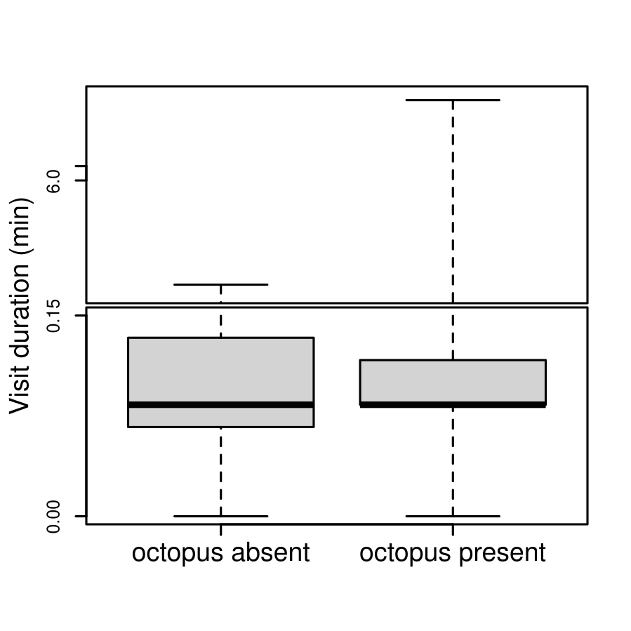
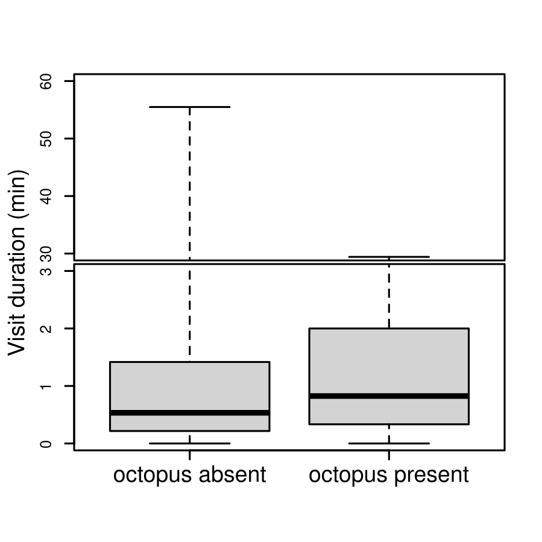

```{r Installing Libraries}
library(remotes)
#install_github("KirtOnthank/CircularTimeHistogram")
library(CircularTimeHistogram)
library(googlesheets4)
library(googledrive)
library(lubridate)
library(maptools)
library(circular)
library(plotrix)
library(perm)
library(vcd)
library(corrplot)
library(png)
```

### Grabbing data and cleaning it up
Getting google sheets authorization (run at least once before knitting)
```{r eval=FALSE}
drive_auth()
gs4_auth(token = drive_token())
```

 Pulling data from google sheets.
```{r}
sheetID="1D53PFAokXS4kHfwSc9riEdKFo8T46GfQxjyo5PEWJg4" #current version
#sheetID="1AT9gaTFz4HwAUMSz0n-klLNREBGdgRFvZdX3tkVj_nM" #01-18-22 version
events=read_sheet(sheetID,"event_log",col_types="icccccccccccc")
#changed the google sheet to be an adapted file without additional octopus frame arrivals within the same day

```

 Cleaning out unfilled rows.
```{r}
events=events[complete.cases(events$Date),]
events=events[complete.cases(events$Behavior),]

```

Reformatting time to POSIX class to make it easier to calc times.
There seems to be two different formats for dates used in the dataset, so I run this command twice.
```{r}
events$realtime_original=
  strptime(paste(events$Date,events$Time),format="%m/%d/%Y %H:%M:%S")
events$realtime_original[is.na(events$realtime_original)]=
  strptime(paste(events$Date[is.na(events$realtime_original)],events$Time[is.na(events$realtime_original)]),format="%Y/%m/%d %H:%M:%S")

```

## fixing times
```{r}
offsets=read_sheet(sheetID,"time_offsets",col_types="iDTTTTTTTTTTi")
```

```{r}
offsets=offsets[complete.cases(offsets),]
offset.tab=aggregate(offset_min~Deployment,data=offsets,FUN="mean")

events$realtime=events$realtime_original

for (i in 1:nrow(offset.tab)){
  events$realtime[events$`Deployment #`==offset.tab$Deploymen[i]]=
    events$realtime_original[events$`Deployment #`==offset.tab$Deploymen[i]]+(offset.tab$offset_min[i]*60)
}
```

# Den Use Dynamics

Things that were to be tested per the proposal:

#. Mean visitation duration
#. Mean excursion duration
#. Day vs. Night visitation duration (t-test)
#. Day vs. night excursion duration (t-test)

Things I think might be good that wasn't actually proposed

#. Frequency of excursions day vs. night (chi-square)

## Making the visitation dataframe
```{r}
visit=data.frame(deployment=as.numeric(NA),
           octoID=as.character(NA),
           time=as.POSIXct(NA),
           duration=as.numeric(NA))

excursion=data.frame(deployment=as.numeric(NA),
           octoID=as.character(NA),
           time=as.POSIXct(NA),
           duration=as.numeric(NA))

badarrival=data.frame(deployment=as.numeric(NA),
           octoID=as.character(NA),
           time1=as.POSIXct(NA),
           time2=as.POSIXct(NA),
           duration=as.numeric(NA))

baddepar=data.frame(deployment=as.numeric(NA),
           octoID=as.character(NA),
           time1=as.POSIXct(NA),
           time2=as.POSIXct(NA),
           duration=as.numeric(NA))
```


## Extracting visitation durations
```{r}

deployments=unique(events$`Deployment #`)


for (i in 1:length(deployments)){
  arrivals=events$realtime[events$Species=="octopus_rubescens"&
                    events$Event_type=="resident non-interaction"&
                    events$Behavior=="frame_arrival"&
                    events$`Deployment #`==deployments[i]]

  arrivals.ID=events$OctoID[events$Species=="octopus_rubescens"&
                    events$Event_type=="resident non-interaction"&
                    events$Behavior=="frame_arrival"&
                    events$`Deployment #`==deployments[i]]

  departures=events$realtime[events$Species=="octopus_rubescens"&
                    events$Event_type=="resident non-interaction"&
                    events$Behavior=="frame_departure"&
                    events$`Deployment #`==deployments[i]]

  departures.ID=events$OctoID[events$Species=="octopus_rubescens"&
                    events$Event_type=="resident non-interaction"&
                    events$Behavior=="frame_departure"&
                    events$`Deployment #`==deployments[i]]

  depar.tags=c(rep("arrive",length(arrivals)),rep("depart",length(departures)))

  deploy.sub=data.frame(time=c(arrivals,departures),octoID=c(arrivals.ID,departures.ID),type=depar.tags)
  deploy.sub=deploy.sub[order(deploy.sub$time),]

  octos.present=unique(deploy.sub$octoID)

  for (j in 1:length(octos.present)){
    if(sum(deploy.sub$octoID==octos.present[j],na.rm=T)>1){
      deploy.single.octo=deploy.sub[deploy.sub$octoID==octos.present[j],] #selecting only one octopus at a time
      
      #Finding which arrivals are immediately followed by a departure
      visit.depar=which(deploy.single.octo$type[1:(nrow(deploy.single.octo)-1)]=="arrive"&deploy.single.octo$type[2:nrow(deploy.single.octo)]=="depart")
      visit.dura=difftime(deploy.single.octo$time[visit.depar+1],deploy.single.octo$time[visit.depar],units = "min")
      visit.stub=data.frame(deployment=rep(deployments[i],length(visit.dura)),
                 octoID=rep(octos.present[j],length(visit.dura)),
                 time=deploy.single.octo$time[visit.depar],
                 duration=as.numeric(visit.dura))
      visit=rbind(visit,visit.stub)

      # Finding which departures are immecidately followed by an arrival      
      excur.depar=which(deploy.single.octo$type[1:(nrow(deploy.single.octo)-1)]=="depart"&deploy.single.octo$type[2:nrow(deploy.single.octo)]=="arrive")
      excur.dura=difftime(deploy.single.octo$time[excur.depar+1],deploy.single.octo$time[excur.depar],units = "min")
      excur.stub=data.frame(deployment=rep(deployments[i],length(excur.dura)),
                 octoID=rep(octos.present[j],length(excur.dura)),
                 time=deploy.single.octo$time[excur.depar],
                 duration=as.numeric(excur.dura))
      excursion=rbind(excursion,excur.stub)
      
      # Finding arrivals followed immediately by another arrival (This should not be possible, so this is error locating)
      badarrival.depar=which(deploy.single.octo$type[1:(nrow(deploy.single.octo)-1)]=="arrive"&deploy.single.octo$type[2:nrow(deploy.single.octo)]=="arrive")
      badarrival.dura=difftime(deploy.single.octo$time[badarrival.depar+1],deploy.single.octo$time[badarrival.depar],units = "min")
      badarrival.stub=data.frame(deployment=rep(deployments[i],length(badarrival.dura)),
                 octoID=rep(octos.present[j],length(badarrival.dura)),
                 time1=deploy.single.octo$time[badarrival.depar],
                 time2=deploy.single.octo$time[badarrival.depar+1],
                 duration=as.numeric(badarrival.dura))
      badarrival=rbind(badarrival,badarrival.stub)
      
      baddepar.depar=which(deploy.single.octo$type[1:(nrow(deploy.single.octo)-1)]=="depart"&deploy.single.octo$type[2:nrow(deploy.single.octo)]=="depart")
      baddepar.dura=difftime(deploy.single.octo$time[baddepar.depar+1],deploy.single.octo$time[baddepar.depar],units = "min")
      baddepar.stub=data.frame(deployment=rep(deployments[i],length(baddepar.dura)),
                 octoID=rep(octos.present[j],length(baddepar.dura)),
                 time1=deploy.single.octo$time[baddepar.depar],
                 time2=deploy.single.octo$time[baddepar.depar+1],
                 duration=as.numeric(baddepar.dura))
      baddepar=rbind(baddepar,baddepar.stub)
      
    }
  }
}

visit=visit[complete.cases(visit),]
excursion=excursion[complete.cases(excursion),]

```


## Adding Day/Night to the visitation data based on sunrise and sunset times.
```{r}
driftwood=matrix(c(-122.6396394,48.1639127), nrow=1)
bay=SpatialPoints(driftwood, proj4string=CRS("+proj=longlat +datum=WGS84"))

visit$daynight="night"
excursion$daynight="night"
visit$day_expected=0
excursion$day_expected=0

for (i in 1:nrow(visit)){
  sunrise=sunriset(bay, as.POSIXct(visit$time[i]), direction="sunrise", POSIXct.out=TRUE)$time
  sunset=sunriset(bay,  as.POSIXct(visit$time[i]), direction="sunset", POSIXct.out=TRUE)$time
  if (visit$time[i]>sunrise&visit$time[i]<sunset) {
    visit$daynight[i]="day"
  }
  visit$day_expected[i]=as.numeric(difftime(sunset,sunrise,units="hours"))/24
}

for (i in 1:nrow(excursion)){
  sunrise=sunriset(bay, as.POSIXct(excursion$time[i]), direction="sunrise", POSIXct.out=TRUE)$time
  sunset=sunriset(bay,  as.POSIXct(excursion$time[i]), direction="sunset", POSIXct.out=TRUE)$time
  if (excursion$time[i]>sunrise&excursion$time[i]<sunset) {
    excursion$daynight[i]="day"
  }
  excursion$day_expected[i]=as.numeric(difftime(sunset,sunrise,units="hours"))/24
}

```


```{r}
mean(visit$duration)
```
```{r}
mean(excursion$duration)
```


## Adding day night and probabilities to each entry in the event log
```{r}
events$daynight="night"
events$day_expected=0

for (i in 1:nrow(events)){
  sunrise=sunriset(bay, as.POSIXct(events$realtime[i]), direction="sunrise", POSIXct.out=TRUE)$time
  sunset=sunriset(bay,  as.POSIXct(events$realtime[i]), direction="sunset", POSIXct.out=TRUE)$time
  if (events$realtime[i]>sunrise&events$realtime[i]<sunset) {
    events$daynight[i]="day"
  }
  events$day_expected[i]=as.numeric(difftime(sunset,sunrise,units="hours"))/24
}
```


# Conspecific interactions

Things that were to be tested per the proposal:

#. "I will use a chi-square test to compare the frequency of different behaviors during interactions."
#. "I will use a t-test to compare the mean interaction duration and"
#. "chi-square to compare conspecific interaction frequency as a function of the time of day (day vs. night)."
#. "A chi-squared test will be used to determine if the relative size of the octopuses in an interaction affects the outcome."

## Making the visitation dataframe
```{r}
nonres.visit=data.frame(deployment=as.numeric(NA),
           octoID=as.character(NA),
           time=as.POSIXct(NA),
           duration=as.numeric(NA))

```


## Extracting non-resident visitation durations
```{r}

deployments=unique(events$`Deployment #`)


for (i in 1:length(deployments)){
  arrivals=events$realtime[events$Species=="octopus_rubescens"&
                    events$Event_type=="non-resident non-interaction"&
                    events$Behavior=="frame_arrival"&
                    events$`Deployment #`==deployments[i]]

  arrivals.ID=events$OctoID[events$Species=="octopus_rubescens"&
                    events$Event_type=="non-resident non-interaction"&
                    events$Behavior=="frame_arrival"&
                    events$`Deployment #`==deployments[i]]

  departures=events$realtime[events$Species=="octopus_rubescens"&
                    events$Event_type=="non-resident non-interaction"&
                    events$Behavior=="frame_departure"&
                    events$`Deployment #`==deployments[i]]

  departures.ID=events$OctoID[events$Species=="octopus_rubescens"&
                    events$Event_type=="non-resident non-interaction"&
                    events$Behavior=="frame_departure"&
                    events$`Deployment #`==deployments[i]]

  if (length(arrivals)>0){
  depar.tags=c(rep("arrive",length(arrivals)),rep("depart",length(departures)))

  deploy.sub=data.frame(time=c(arrivals,departures),octoID=c(arrivals.ID,departures.ID),type=depar.tags)
  deploy.sub=deploy.sub[order(deploy.sub$time),]

  octos.present=unique(deploy.sub$octoID)

  for (j in 1:length(octos.present)){
    if(sum(deploy.sub$octoID==octos.present[j],na.rm=T)>1){
      deploy.single.octo=deploy.sub[deploy.sub$octoID==octos.present[j],] #selecting only one octopus at a time
      
      #Finding which arrivals are immediately followed by a departure
      visit.depar=which(deploy.single.octo$type[1:(nrow(deploy.single.octo)-1)]=="arrive"&
                          deploy.single.octo$type[2:nrow(deploy.single.octo)]=="depart")
      visit.dura=difftime(deploy.single.octo$time[visit.depar+1],deploy.single.octo$time[visit.depar],units = "min")
      visit.stub=data.frame(deployment=rep(deployments[i],length(visit.dura)),
                 octoID=rep(octos.present[j],length(visit.dura)),
                 time=deploy.single.octo$time[visit.depar],
                 duration=as.numeric(visit.dura))
      nonres.visit=rbind(nonres.visit,visit.stub)

      
      # Finding arrivals followed immediately by another arrival (This should not be possible, so this is error locating)
      badarrival.depar=which(deploy.single.octo$type[1:(nrow(deploy.single.octo)-1)]=="arrive"&
                               deploy.single.octo$type[2:nrow(deploy.single.octo)]=="arrive")
      badarrival.dura=difftime(deploy.single.octo$time[badarrival.depar+1],deploy.single.octo$time[badarrival.depar],units = "min")
      badarrival.stub=data.frame(deployment=rep(deployments[i],length(badarrival.dura)),
                 octoID=rep(octos.present[j],length(badarrival.dura)),
                 time1=deploy.single.octo$time[badarrival.depar],
                 time2=deploy.single.octo$time[badarrival.depar+1],
                 duration=as.numeric(badarrival.dura))
      badarrival=rbind(badarrival,badarrival.stub)
      
      baddepar.depar=which(deploy.single.octo$type[1:(nrow(deploy.single.octo)-1)]=="depart"&
                             deploy.single.octo$type[2:nrow(deploy.single.octo)]=="depart")
      baddepar.dura=difftime(deploy.single.octo$time[baddepar.depar+1],deploy.single.octo$time[baddepar.depar],units = "min")
      baddepar.stub=data.frame(deployment=rep(deployments[i],length(baddepar.dura)),
                 octoID=rep(octos.present[j],length(baddepar.dura)),
                 time1=deploy.single.octo$time[baddepar.depar],
                 time2=deploy.single.octo$time[baddepar.depar+1],
                 duration=as.numeric(baddepar.dura))
      baddepar=rbind(baddepar,baddepar.stub)
    }
    }
  }
}


nonres.visit=nonres.visit[complete.cases(nonres.visit),]
```


## Adding Day/Night to the non-resident visitation data based on sunrise and sunset times.
```{r}

nonres.visit$daynight="night"
nonres.visit$day_expected=0

for (i in 1:nrow(nonres.visit)){
  sunrise=sunriset(bay, as.POSIXct(nonres.visit$time[i]), direction="sunrise", POSIXct.out=TRUE)$time
  sunset=sunriset(bay,  as.POSIXct(nonres.visit$time[i]), direction="sunset", POSIXct.out=TRUE)$time
  if (nonres.visit$time[i]>sunrise&nonres.visit$time[i]<sunset) {
    nonres.visit$daynight[i]="day"
  }
  nonres.visit$day_expected[i]=as.numeric(difftime(sunset,sunrise,units="hours"))/24
}

```


## Visualization
# Plotting octopus arrival times

#should we be plotting frame arrival because the start of each deployment begins with a frame_arrival, wouldnt it be more useful to plot frame departures??
```{r}
octo.visits=events$realtime[events$Behavior=="frame_departure"&events$Species=="octopus_rubescens"]

DayHist(octo.visits,date="07/10/2021")
```

#Graph species
#its not ellegant but i can easily change the graph to exclude or include any species I want
```{r}

fish1=events$Species=="lingcod"
fish2=events$Species=="quillback_rockfish"
fish3=events$Species=="pile_perch"
fish4=events$Species=="kelp greenling"
fish5=events$Species=="copper_rockfish"
fish6=events$Species=="painted greenling"
fish7=events$Species=="china_rockfish"
fish8=events$Species=="octopus_rubescens"
fish9=events$Species=="spiny dogfish"
fish10=events$Species=="buffalo sculpin"
fish11=events$Species=="wolf eel"
fish12=events$Species=="flatfish"
fish13=events$Species=="sailfin sculpin"

#fish=fish1+fish2+fish3+fish4+fish5+fish6+fish7+fish9+fish10+fish11+fish12+fish13
fish=fish8


crabs1=events$Species=="red rock crab"
crabs2=events$Species=="dungeness crab"
crabs3=events$Species=="cancer crab"
crabs4=events$Species=="helmet_crab"
crabs5=events$Species=="kelp_crab"
crabs6=events$Species=="urchin"
crabs7=events$Species=="sea_cucumber"
crabs8=events$Species=="sea_star"


crabs=crabs1

to.plot=events$realtime[events$Behavior=="frame_departure"&fish]

#png(filename="Ling_and_kelpies.png",width=1000,height=1000,res=200)
DayHist(to.plot,date="07/10/2021",hist.zoom = 6)
#dev.off()
to.plot
```

##to graph different behaviors in unison
```{r}

fish1=events$Species=="lingcod"
fish2=events$Species=="quillback_rockfish"
fish4=events$Species=="kelp greenling"
fish5=events$Species=="copper_rockfish"
fish6=events$Species=="painted greenling"
fish7=events$Species=="china_rockfish"
fish8=events$Species=="octopus_rubescens"
fish=fish8


behave1=events$Behavior=="enter_bottle"
behave2=events$Behavior=="fortify"
behave3=events$Behavior=="touch_bottle"
behave4=events$Behavior=="den_opening"
behave5=events$Behavior=="touch_resident"
behave6=events$Behavior=="exit_bottle"
behave7=events$Behavior=="periscope"
behave8=events$Behavior=="predation"
behave9=events$Behavior=="sat_outside"
behave10=events$Behavior=="looking_in_bottle"
behave11=events$Behavior=="depositing_waste_outside_den"

#behave=behave1+behave3+behave4+behave5+behave6+behave7+behave8+behave9+behave10+behave11
#behave=behave5+behave1+behave7+behave6
behave=behave5


to.plot=events$realtime[behave&fish]

#png(filename="Ling_and_kelpies.png",width=1000,height=1000,res=200)
DayHist(to.plot,date="07/10/2021",hist.zoom = 4.5)
#dev.off()
to.plot
```


# Statistical Analysis
## Chi Square example

For this example we will look at kelp greenling visitation.
First we will make a table of the distribution of kelp greenling frame arrival events in the day and night
```{r}
kelpy.daynight=as.numeric(table(events$daynight[events$Behavior=="frame_arrival"&events$Species=="kelp greenling"]))

```
Next we need to make a vector that has the probability of seeing a kelp greenling in the day or night if kelp greenling show up randomly with respect to time.  This essentially, therefore, is what percentage of time is day vs. night.
```{r}
kelpy.probs=c(
mean(events$day_expected[events$Behavior=="frame_arrival"&events$Species=="kelp greenling"]),
1-mean(events$day_expected[events$Behavior=="frame_arrival"&events$Species=="kelp greenling"])
)
kelpy.probs
```

Now we can do the chi-squared test
```{r}
kelpy.chi=chisq.test(kelpy.daynight,p=kelpy.probs)
kelpy.chi
```


## T-test example

Lets look to see if non-resident visits are longer in the day or in the night.   We have already extracted that data and it is in nonres.visit.  So, we can just call it from there. 

First, we need to test our assumptions.  The bartlett test looks for equal variances.
```{r}
bartlett.test(nonres.visit$duration,nonres.visit$daynight)
```
So, we fail the Bartlett test (p<0.05). The variances are no equal between the   We will look at normality as well anyhow using a Shapiro-Wilks test.

```{r}
shapiro.test(nonres.visit$duration[nonres.visit$daynight=="night"])
shapiro.test(nonres.visit$duration[nonres.visit$daynight=="day"])
```

Well, the night data is normally distributed (p>0.05), but the daytime data is not (p<0.05)

The correct way to do this is to use a non-parametric or permutation test. I prefer permutation tests (they are more powerful than non-parametric tests, meaning they are more likely to reject the null hypothesis is it should be). This is how you would do it.  

```{r}
permTS(nonres.visit$duration[nonres.visit$daynight=="day"],nonres.visit$duration[nonres.visit$daynight=="night"],
       alternative="two.sided",method="exact.mc",control=permControl(nmc=10000))
```

If you passed you assumptions test and could do a t-test, this is how you would do it:
```{r}
t.test(duration~daynight,data=nonres.visit,var.equal=T)
```

## octopus visitations: day vs night
```{r}
depart.daynight=as.numeric(table(events$daynight[events$Behavior=="frame_departure"&events$Species=="octopus_rubescens"]))

depart.probs=c(
mean(events$day_expected[events$Behavior=="frame_departure"&events$Species=="octopus_rubescens"]),
1-mean(events$day_expected[events$Behavior=="frame_departure"&events$Species=="octopus_rubescens"])
)

depart.chi=chisq.test(depart.daynight,p=depart.probs)
depart.chi
```


## octopus den fortification: day vs. night
```{r fortification chi}
fort.daynight=as.numeric(table(events$daynight[events$Behavior=="fortify"&events$Species=="octopus_rubescens"]))

fort.probs=c(
mean(events$day_expected[events$Behavior=="fortify"&events$Species=="octopus_rubescens"]),
1-mean(events$day_expected[events$Behavior=="fortify"&events$Species=="octopus_rubescens"])
)

fort.chi=chisq.test(fort.daynight,p=fort.probs)
fort.chi

```

## octopus periscope: day vs night
```{r}
periscope.daynight=as.numeric(table(events$daynight[events$Behavior=="periscope"&events$Species=="octopus_rubescens"]))

peri.probs=c(
mean(events$day_expected[events$Behavior=="periscope"&events$Species=="octopus_rubescens"]),
1-mean(events$day_expected[events$Behavior=="periscope"&events$Species=="octopus_rubescens"])
)

peri.chi=chisq.test(periscope.daynight,p=peri.probs)
peri.chi
```

## octopus bottle enter and exit: day vs night
```{r}
enterexit.daynight=as.numeric(table(events$daynight[events$Behavior=="enter_bottle"&events$Species=="octopus_rubescens"|events$Behavior=="exit_bottle"&events$Species=="octopus_rubescens"]))

enterexit.probs=c(
mean(events$day_expected[events$Behavior=="enter_bottle"&events$Species=="octopus_rubescens"|events$Behavior=="exit_bottle"&events$Species=="octopus_rubescens"]),
1-mean(events$day_expected[events$Behavior=="enter_bottle"&events$Species=="octopus_rubescens"|events$Behavior=="exit_bottle"&events$Species=="octopus_rubescens"])
)

enterexit.chi=chisq.test(enterexit.daynight,p=enterexit.probs)
enterexit.chi
```

# crabs day vs night
```{r}

to.plot=events$realtime[events$Behavior=="frame_arrival"&crabs]

crab.daynight=as.numeric(table(events$daynight[events$Behavior=="frame_arrival"&crabs]))
crab.daynight

crab.probs=c(
mean(events$day_expected[events$Behavior=="frame_arrival"&crabs]),
1-mean(events$day_expected[events$Behavior=="frame_arrival"&crabs])
)

crab.chi=chisq.test(crab.daynight,p=crab.probs)
crab.chi$p.value

```


# Time histogram figure

```{r}
table(events$Behavior[events$Species=="octopus_rubescens"])
```


```{r time hist}
moon=readPNG("moon.png")
sun=readPNG("sun.png")
svg(filename="timing.svg")
par(fig=c(0,0.5,0.5,1))
DayHist(events$realtime[events$Species=="octopus_rubescens"&events$Behavior=="fortify"],date="07/10/2021",hist.zoom=4,
        night.col="lightskyblue3")
rasterImage(moon,-0.15,0.6,0.15,0.9)
rasterImage(sun,-0.15,-0.6,0.15,-0.9)
mtext("Fortification",side=3,line=1.5,cex=1.5)

if(fort.chi$p.value>0.0001){
  mtext(paste("n=",nrow(events[events$Species=="octopus_rubescens"&events$Behavior=="fortify",]),
              " p=",format(signif(fort.chi$p.value,1),scientific = F),sep=""),
      side=3,line=0.6,cex=1)
} else{
  mtext(paste("n=",nrow(events[events$Species=="octopus_rubescens"&events$Behavior=="fortify",]),
              " p<0.0001",sep=""),
      side=3,line=0.6,cex=1)
}

par(fig=c(0.5,1,0.5,1),new=T)
DayHist(events$realtime[events$Species=="octopus_rubescens"&events$Behavior=="frame_departure"],date="07/10/2021",hist.zoom=8,
        night.col="lightskyblue3")
rasterImage(moon,-0.15,0.6,0.15,0.9)
rasterImage(sun,-0.15,-0.6,0.15,-0.9)
mtext("Frame departures",side=3,line=1.5,cex=1.5)

if(depart.chi$p.value>0.0001){
  mtext(paste("n=",nrow(events[events$Species=="octopus_rubescens"&events$Behavior=="frame_departure",]),
              " p=",format(signif(depart.chi$p.value,1),scientific = F),sep=""),
      side=3,line=0.6,cex=1)
} else{
  mtext(paste("n=",nrow(events[events$Species=="octopus_rubescens"&events$Behavior=="frame_departure",]),
              " p<0.0001",sep=""),
      side=3,line=0.6,cex=1)
}

par(fig=c(0,0.5,0,0.5),new=T)
DayHist(events$realtime[events$Species=="octopus_rubescens"&events$Behavior=="periscope"],date="07/10/2021",hist.zoom=4.5,
        night.col="lightskyblue3")
rasterImage(moon,-0.15,0.6,0.15,0.9)
rasterImage(sun,-0.15,-0.6,0.15,-0.9)
mtext("Periscoping",side=3,line=1.5,cex=1.5)

if(peri.chi$p.value>0.0001){
  mtext(paste("n=",nrow(events[events$Species=="octopus_rubescens"&events$Behavior=="periscope",]),
              " p=",format(signif(peri.chi$p.value,1),scientific = F),sep=""),
      side=3,line=0.6,cex=1)
} else{
  mtext(paste("n=",nrow(events[events$Species=="octopus_rubescens"&events$Behavior=="periscope",]),
              " p<0.0001",sep=""),
      side=3,line=0.6,cex=1)
}


par(fig=c(0.5,1,0,0.5),new=T)
DayHist(events$realtime[events$Species=="octopus_rubescens"&events$Behavior=="enter_bottle"|events$Species=="octopus_rubescens"&events$Behavior=="exit_bottle"],date="07/10/2021",hist.zoom=4.5,
        night.col="lightskyblue3")
rasterImage(moon,-0.15,0.6,0.15,0.9)
rasterImage(sun,-0.15,-0.6,0.15,-0.9)
mtext("Enter/exit bottle",side=3,line=1.5,cex=1.5)
if(enterexit.chi$p.value>0.0001){
  mtext(paste("n=",nrow(events[events$Species=="octopus_rubescens"&events$Behavior=="enter_bottle"|events$Species=="octopus_rubescens"&events$Behavior=="exit_bottle",]),
              " p=",format(signif(enterexit.chi$p.value,1),scientific = F),sep=""),
      side=3,line=0.6,cex=1)
} else{
  mtext(paste("n=",nrow(events[events$Species=="octopus_rubescens"&events$Behavior=="enter_bottle"|events$Species=="octopus_rubescens"&events$Behavior=="exit_bottle",]),
              " p<0.0001",sep=""),
      side=3,line=0.6,cex=1)
}

dev.off()

```


# Interspecific Interaction Analysis

Turning all rockfish species into just "rockfish".  I am doing this down here so I don't break your code above that relies on your sorting with different rockfish.  If you change that, we can put this earlier in the code.
```{r}
events$Species[grep("rockfish",events$Species)]="rockfish"
```

Now I am taking a quick look at how many time each species appears in the data.
```{r}
table(events$Species[events$Behavior=="frame_arrival"])
```
It looks like we have enough data to do this analysis on rockfish, red rock crabs, kelp greenling, lingcod and maybe painted greenling. I think everything else doesn't have enough sightings to be worthwile.


## Finding times where there are no octopuses

This code only needs to run once. I am making a dataframe that specifies how many octopuses are present at any given time. First, I convert all the second_arrivals and second departure to normal frame arrivals and departure events. Then, I exact every time a deployment starts, ends, an octopus arrives, or departs
```{r}
events$Behavior[events$Behavior=="second_departure"]="frame_departure"
events$Behavior[events$Behavior=="second_arrival"]="frame_arrival"

octos.present=events[events$Behavior=="deploy_start"|
         events$Species=="octopus_rubescens"&
         events$Behavior=="frame_arrival"|
         events$Species=="octopus_rubescens"&
         events$Behavior=="frame_departure"|
         events$Species=="octopus_rubescens"&
         events$Behavior=="deploy_start"|
         events$Behavior=="deploy_end",
         ]
```

Next, I make sure that the entries in this dataframe are in chonological order within each deployment.
```{r}

for (i in 1:length(deployments)){
  temp=octos.present[octos.present$`Deployment #`==deployments[i],]
  temp=temp[order(temp$realtime),]
  octos.present[octos.present$`Deployment #`==deployments[i],]=temp
}
```


Now, I add a column to the dataframe called "number" that will be a tally of how many octopuses are in the frame.  I will start each deployment with the number at 0, add an octopus for each frame arrival and substract one octopus for each frame departure.
```{r}
octos.present$number=0

for (i in 1:length(deployments)){
  behaviors=octos.present$Behavior[octos.present$`Deployment #`==deployments[i]]
  present=rep(0,length(behaviors))
  for (j in 2:length(behaviors)){
    if (behaviors[j]=="frame_arrival"){
      present[j]=present[j-1]+1
    }
    if (behaviors[j]=="frame_departure"){
      present[j]=present[j-1]-1
    }
    if (behaviors[j]=="deploy_end"){
      present[j]=present[j-1]
    }
  }
  octos.present$number[octos.present$`Deployment #`==deployments[i]]=present
}

```


The dataframe I made has the start time for each time period, but not the end.  I will add the end by taking the starting time of the next time period.
```{r}
octos.present$endtime=octos.present$realtime[1]


for (i in 1:length(deployments)){
  octos.present$endtime[head(which(octos.present$`Deployment #`==deployments[i]),-1)]= #All of the times excepts the last (which is the end of deployment)
    octos.present$realtime[tail(which(octos.present$`Deployment #`==deployments[i]),-1)] #is replaced by all of the times except the first
}

octos.present=octos.present[!octos.present$Behavior=="deploy_end",]


```


Finding durations of each time period
```{r}
octos.present$duration=as.numeric(difftime(octos.present$endtime,octos.present$realtime,units = "min"))
```

finding total time with and without octopuses
```{r}
min.absent=sum(octos.present$duration[octos.present$number==0])
min.present=sum(octos.present$duration[octos.present$number>0])
min.absent
min.present
```

## Finding times where there are no Resident octopuses present
This is just an adaptation of the code above that finds times when octopuses are present or not, just adapted for resident octopuses.
This code only needs to run once. I am making a dataframe that specifies how many resident octopuses are present at any given time. First, I exact every time a deployment starts, ends, an octopus arrives, or departs


```{r}

residents.present=events[events$Behavior=="deploy_start"|
         events$Species=="octopus_rubescens"&
         events$Behavior=="frame_arrival"&
         events$Event_type=="resident non-interaction"|
         events$Species=="octopus_rubescens"&
         events$Behavior=="frame_departure"&
         events$Event_type=="resident non-interaction"|
         events$Species=="octopus_rubescens"&
         events$Behavior=="deploy_start"&
         events$Event_type=="resident non-interaction"|
         events$Behavior=="deploy_end",
         ]
```

Next, I make sure that the entries in this dataframe are in chonological order within each deployment.
```{r}

for (i in 1:length(deployments)){
  temp=residents.present[residents.present$`Deployment #`==deployments[i],]
  temp=temp[order(temp$realtime),]
  residents.present[residents.present$`Deployment #`==deployments[i],]=temp
}
```


Now, I add a column to the dataframe called "number" that will be a tally of how many octopuses are in the frame.  I will start each deployment with the number at 0, add an octopus for each frame arrival and substract one octopus for each frame departure.
```{r}
residents.present$number=0

for (i in 1:length(deployments)){
  behaviors=residents.present$Behavior[residents.present$`Deployment #`==deployments[i]]
  present=rep(0,length(behaviors))
  for (j in 2:length(behaviors)){
    if (behaviors[j]=="frame_arrival"){
      present[j]=present[j-1]+1
    }
    if (behaviors[j]=="frame_departure"){
      present[j]=present[j-1]-1
    }
    if (behaviors[j]=="deploy_end"){
      present[j]=present[j-1]
    }
  }
  residents.present$number[residents.present$`Deployment #`==deployments[i]]=present
}

```


The dataframe I made has the start time for each time period, but not the end.  I will add the end by taking the starting time of the next time period.
```{r}
residents.present$endtime=residents.present$realtime[1]


for (i in 1:length(deployments)){
  residents.present$endtime[head(which(residents.present$`Deployment #`==deployments[i]),-1)]= #All of the times excepts the last (which is the end of deployment)
    residents.present$realtime[tail(which(residents.present$`Deployment #`==deployments[i]),-1)] #is replaced by all of the times except the first
}

residents.present=residents.present[!residents.present$Behavior=="deploy_end",]


```


Finding durations of each time period
```{r}
residents.present$duration=as.numeric(difftime(residents.present$endtime,residents.present$realtime,units = "min"))
```

finding total time with and without octopuses
```{r}
min.res.absent=sum(residents.present$duration[residents.present$number==0])
min.res.present=sum(residents.present$duration[residents.present$number>0])
min.res.absent
min.res.present
```


## Kelp Greenling Analysis
### Kelp Greenling visitation frequency with octopuses absent vs. present.
In this chunk I am tallying kelp greenling arrivals when octopuses are present versus absent.
```{r}
kelpies=numeric()

for (i in 1:nrow(octos.present)){
  kelpies[i]=sum(events$Species=="kelp greenling"&
    events$Behavior=="frame_arrival"&
    events$`Deployment #`==octos.present$`Deployment #`[i]&
    events$realtime>octos.present$realtime[i]&
    events$realtime<octos.present$endtime[i])
}

kelpies.absent=sum(kelpies[octos.present$number==0])
kelpies.present=sum(kelpies[octos.present$number>0])
kelpies.absent
kelpies.present
```

Next I perform a chi square test to see if the kelp greenling visitation frequency is significantly different that random.Here, I am using the probability in each category (absent vs. present) as the proportion of time octopuses were absent versus present.
```{r}
probs=c(min.absent/(min.absent+min.present),min.present/(min.absent+min.present))

chisq.test(c(kelpies.absent,kelpies.present),p=probs)
```


### Kelp greenling visitation duration when octopuses are absent versus present.
First, I make dataframes to hold my visit duration information and catalog potential bad arrivals and departure entries.

```{r}
kelpie.visit=data.frame(deployment=as.numeric(NA),
           time=as.POSIXct(NA),
           duration=as.numeric(NA))

kelpie.badarrival=data.frame(deployment=as.numeric(NA),
           time1=as.POSIXct(NA),
           time2=as.POSIXct(NA),
           duration=as.numeric(NA))

kelpie.baddepar=data.frame(deployment=as.numeric(NA),
           time1=as.POSIXct(NA),
           time2=as.POSIXct(NA),
           duration=as.numeric(NA))

```

Next, I calculate the duration of each kelp greenling visit.

```{r}


for (i in 1:length(deployments)){
  arrivals=events$realtime[events$Species=="kelp greenling"&
                    events$Behavior=="frame_arrival"&
                    events$`Deployment #`==deployments[i]]

  departures=events$realtime[events$Species=="kelp greenling"&
                    events$Behavior=="frame_departure"&
                    events$`Deployment #`==deployments[i]]

  if (length(arrivals)>0){
  depar.tags=c(rep("arrive",length(arrivals)),rep("depart",length(departures)))

  deploy.sub=data.frame(time=c(arrivals,departures),type=depar.tags)
  deploy.sub=deploy.sub[order(deploy.sub$time),]


      #Finding which arrivals are immediately followed by a departure
      visit.depar=which(deploy.sub$type[1:(nrow(deploy.sub)-1)]=="arrive"&
                          deploy.sub$type[2:nrow(deploy.sub)]=="depart")
      # Now calculating the 
      visit.dura=difftime(deploy.sub$time[visit.depar+1],deploy.sub$time[visit.depar],units = "min")
      visit.stub=data.frame(deployment=rep(deployments[i],length(visit.dura)),
                 time=deploy.sub$time[visit.depar],
                 duration=as.numeric(visit.dura))
      kelpie.visit=rbind(kelpie.visit,visit.stub)

            # Finding arrivals followed immediately by another arrival (This should not be possible, so this is error locating)
      badarrival.depar=which(deploy.sub$type[1:(nrow(deploy.sub)-1)]=="arrive"&
                               deploy.sub$type[2:nrow(deploy.sub)]=="arrive")
      badarrival.dura=difftime(deploy.sub$time[badarrival.depar+1],deploy.sub$time[badarrival.depar],units = "min")
      badarrival.stub=data.frame(deployment=rep(deployments[i],length(badarrival.dura)),
                 time1=deploy.sub$time[badarrival.depar],
                 time2=deploy.sub$time[badarrival.depar+1],
                 duration=as.numeric(badarrival.dura))
      kelpie.badarrival=rbind(kelpie.badarrival,badarrival.stub)
      
      baddepar.depar=which(deploy.sub$type[1:(nrow(deploy.sub)-1)]=="depart"&
                             deploy.sub$type[2:nrow(deploy.sub)]=="depart")
      baddepar.dura=difftime(deploy.sub$time[baddepar.depar+1],deploy.sub$time[baddepar.depar],units = "min")
      baddepar.stub=data.frame(deployment=rep(deployments[i],length(baddepar.dura)),
                 time1=deploy.sub$time[baddepar.depar],
                 time2=deploy.sub$time[baddepar.depar+1],
                 duration=as.numeric(baddepar.dura))
      kelpie.baddepar=rbind(kelpie.baddepar,baddepar.stub)

      
    }
}


kelpie.visit=kelpie.visit[complete.cases(kelpie.visit),]
```


Adding if octopuses are present or absent during each visit to my dataframe
```{r}
kelpie.visit$octopus="unknown"


for (i in 1:nrow(octos.present)){
  if (octos.present$number[i]>0){
    kelpie.visit$octopus[kelpie.visit$deployment==octos.present$`Deployment #`[i]&
                 kelpie.visit$time>octos.present$realtime[i]&
                 kelpie.visit$time<octos.present$endtime[i]]="present"
  }
  if (octos.present$number[i]==0){
    kelpie.visit$octopus[kelpie.visit$deployment==octos.present$`Deployment #`[i]&
                 kelpie.visit$time>octos.present$realtime[i]&
                 kelpie.visit$time<octos.present$endtime[i]]="absent"
  }
}

kelpie.visit=kelpie.visit[!kelpie.visit$octopus=="unknown",]
```

Adding if each kelpie visit was during the day or the night
```{r}
kelpie.visit$daynight="night"
kelpie.visit$day_expected=0

for (i in 1:nrow(kelpie.visit)){
  sunrise=sunriset(bay, as.POSIXct(kelpie.visit$time[i]), direction="sunrise", POSIXct.out=TRUE)$time
  sunset=sunriset(bay,  as.POSIXct(kelpie.visit$time[i]), direction="sunset", POSIXct.out=TRUE)$time
  if (kelpie.visit$time[i]>sunrise&kelpie.visit$time[i]<sunset) {
    kelpie.visit$daynight[i]="day"
  }
  kelpie.visit$day_expected[i]=as.numeric(difftime(sunset,sunrise,units="hours"))/24
}
```

Getting distribution of observations for chi-squared test
```{r}
kelpie.tab=
  as.vector(table(kelpie.visit$octopus))
kelpie.tab
```


Setting up probabilities for chi-squared test
```{r}
kelpie.probs=
  c(min.absent/(min.absent+min.present),min.present/(min.absent+min.present))
kelpie.probs
```

Running chi-squared test
```{r kelpie chi}
kelpie.chi=chisq.test(kelpie.tab,p=kelpie.probs)
kelpie.chi
```

Plotting chi-squared residuals
```{r}
kelpie.res=matrix(kelpie.chi$residuals,ncol=2)
colnames(kelpie.res)=c("octopus absent","octopus present")

corrplot(kelpie.res,is.cor=F,col.lim=c(-5,5))
```


Testing my assumptions for T-Test
```{r}
shapiro.test(kelpie.visit$duration[kelpie.visit$octopus=="present"])
shapiro.test(kelpie.visit$duration[kelpie.visit$octopus=="absent"])
bartlett.test(kelpie.visit$duration,kelpie.visit$octopus)
```

Assumptions fail, so I am using a permutation two-sample test.
```{r kelpie permTS}
kelpie.permTS=permTS(kelpie.visit$duration[kelpie.visit$octopus=="absent"],kelpie.visit$duration[kelpie.visit$octopus=="present"],
       alternative="two.sided",method="exact.mc",control=permControl(nmc=10000))
kelpie.permTS
```
Very significant!

Seeing what the mean difference is between kelp greenling visit duration when octopuses are absent versus octopuses are present.
```{r}
aggregate(duration~octopus,data=kelpie.visit,FUN="mean")
```
Plotting the data.
```{r kelpie raw boxplot}
boxplot(duration~octopus,data=kelpie.visit,range=0)
```

This boxplot looks horrible so I am manually making boxplot with a broken Y-axis so the long tails don't obscure the main portion of the data.

```{r}
svg("Kelpy_visitation_duration.svg",width=3,height=3,pointsize = 6)
par(fig=c(0,1,0.35,1))
boxplot(duration~octopus,data=kelpie.visit,range=0,ylim=c(6,6.7),axes=F,ylab="",xlab="")
axis(2,at=c(6,6.5))
box()

par(fig=c(0,1,0,0.65),new=T)
boxplot(duration~octopus,data=kelpie.visit,range=0,ylim=c(0,0.7),axes=F,ylab="",xlab="")
axis(2,at=c(0,0.5))
axis(1,at=c(1,2),label=c("octopus absent","octopus present"),cex.axis=1.5)
box()

par(fig=c(0,1,0,1),new=T)
plot(c(0,1),c(0,1),type="n",axes=F,ylab="",xlab="")
mtext("Visit duration (min)",side=2,line=2.5,cex=1.5)

dev.off()
```
```{bash}
cairosvg Kelpy_visitation_duration.svg -o Kelpy_visitation_duration.png -d 300
```


## Lingcod Analysis
### Lingcod visitation frequency with octopuses absent vs. present.
In this chunk I am tallying Lingcod arrivals when octopuses are present versus absent.
```{r}
lings=numeric()

for (i in 1:nrow(octos.present)){
  lings[i]=sum(events$Species=="lingcod"&
    events$Behavior=="frame_arrival"&
    events$`Deployment #`==octos.present$`Deployment #`[i]&
    events$realtime>octos.present$realtime[i]&
    events$realtime<octos.present$endtime[i])
}

lings.absent=sum(lings[octos.present$number==0])
lings.present=sum(lings[octos.present$number>0])
lings.absent
lings.present
```

Next I perform a chi square test to see if the lingcod visitation frequency is significantly different that random. Here, I am using the probability in each category (absent vs. present) as the proportion of time octopuses were absent versus present.
```{r}
probs=c(min.absent/(min.absent+min.present),min.present/(min.absent+min.present))

chisq.test(c(lings.absent,lings.present),p=probs)
```


### lingcod visitation duration when octopuses are absent versus present.
First, I make dataframes to hold my visit duration information and catalog potential bad arrivals and departure entries.

```{r}
ling.visit=data.frame(deployment=as.numeric(NA),
           time=as.POSIXct(NA),
           duration=as.numeric(NA))

ling.badarrival=data.frame(deployment=as.numeric(NA),
           time1=as.POSIXct(NA),
           time2=as.POSIXct(NA),
           duration=as.numeric(NA))

ling.baddepar=data.frame(deployment=as.numeric(NA),
           time1=as.POSIXct(NA),
           time2=as.POSIXct(NA),
           duration=as.numeric(NA))

```

Next, I calculate the duration of each lingcod visit.

```{r}


for (i in 1:length(deployments)){
  arrivals=events$realtime[events$Species=="lingcod"&
                    events$Behavior=="frame_arrival"&
                    events$`Deployment #`==deployments[i]]

  departures=events$realtime[events$Species=="lingcod"&
                    events$Behavior=="frame_departure"&
                    events$`Deployment #`==deployments[i]]

  if (length(arrivals)>0){
  depar.tags=c(rep("arrive",length(arrivals)),rep("depart",length(departures)))

  deploy.sub=data.frame(time=c(arrivals,departures),type=depar.tags)
  deploy.sub=deploy.sub[order(deploy.sub$time),]


      #Finding which arrivals are immediately followed by a departure
      visit.depar=which(deploy.sub$type[1:(nrow(deploy.sub)-1)]=="arrive"&
                          deploy.sub$type[2:nrow(deploy.sub)]=="depart")
      # Now calculating the 
      visit.dura=difftime(deploy.sub$time[visit.depar+1],deploy.sub$time[visit.depar],units = "min")
      visit.stub=data.frame(deployment=rep(deployments[i],length(visit.dura)),
                 time=deploy.sub$time[visit.depar],
                 duration=as.numeric(visit.dura))
      ling.visit=rbind(ling.visit,visit.stub)

            # Finding arrivals followed immediately by another arrival (This should not be possible, so this is error locating)
      badarrival.depar=which(deploy.sub$type[1:(nrow(deploy.sub)-1)]=="arrive"&
                               deploy.sub$type[2:nrow(deploy.sub)]=="arrive")
      badarrival.dura=difftime(deploy.sub$time[badarrival.depar+1],deploy.sub$time[badarrival.depar],units = "min")
      badarrival.stub=data.frame(deployment=rep(deployments[i],length(badarrival.dura)),
                 time1=deploy.sub$time[badarrival.depar],
                 time2=deploy.sub$time[badarrival.depar+1],
                 duration=as.numeric(badarrival.dura))
      ling.badarrival=rbind(ling.badarrival,badarrival.stub)
      
      baddepar.depar=which(deploy.sub$type[1:(nrow(deploy.sub)-1)]=="depart"&
                             deploy.sub$type[2:nrow(deploy.sub)]=="depart")
      baddepar.dura=difftime(deploy.sub$time[baddepar.depar+1],deploy.sub$time[baddepar.depar],units = "min")
      baddepar.stub=data.frame(deployment=rep(deployments[i],length(baddepar.dura)),
                 time1=deploy.sub$time[baddepar.depar],
                 time2=deploy.sub$time[baddepar.depar+1],
                 duration=as.numeric(baddepar.dura))
      ling.baddepar=rbind(ling.baddepar,baddepar.stub)

      
    }
}


ling.visit=ling.visit[complete.cases(ling.visit),]
ling.visit
```


Adding if octopuses are present or absent during each visit to my dataframe
```{r}
ling.visit$octopus="unknown"


for (i in 1:nrow(octos.present)){
  if (octos.present$number[i]>0){
    ling.visit$octopus[ling.visit$deployment==octos.present$`Deployment #`[i]&
                 ling.visit$time>octos.present$realtime[i]&
                 ling.visit$time<octos.present$endtime[i]]="present"
  }
  if (octos.present$number[i]==0){
    ling.visit$octopus[ling.visit$deployment==octos.present$`Deployment #`[i]&
                 ling.visit$time>octos.present$realtime[i]&
                 ling.visit$time<octos.present$endtime[i]]="absent"
  }
}

ling.visit=ling.visit[!ling.visit$octopus=="unknown",]
```

Adding if each ling visit was during the day or the night
```{r}
ling.visit$daynight="night"
ling.visit$day_expected=0

for (i in 1:nrow(ling.visit)){
  sunrise=sunriset(bay, as.POSIXct(ling.visit$time[i]), direction="sunrise", POSIXct.out=TRUE)$time
  sunset=sunriset(bay,  as.POSIXct(ling.visit$time[i]), direction="sunset", POSIXct.out=TRUE)$time
  if (ling.visit$time[i]>sunrise&ling.visit$time[i]<sunset) {
    ling.visit$daynight[i]="day"
  }
  ling.visit$day_expected[i]=as.numeric(difftime(sunset,sunrise,units="hours"))/24
}
```

Getting distribution of observations for chi-squared test
```{r}
ling.tab=
  as.vector(table(ling.visit$octopus))
```


Setting up probabilities for chi-squared test
```{r}
ling.probs=
  c(min.absent/(min.absent+min.present),min.present/(min.absent+min.present))
```

Running chi-squared test
```{r ling chi}
ling.chi=chisq.test(ling.tab,p=ling.probs)
ling.chi
```

Plotting chi-squared residuals
```{r}
ling.res=matrix(ling.chi$residuals,ncol=2)
colnames(ling.res)=c("octopus absent","octopus present")

corrplot(ling.res,is.cor=F,col.lim=c(-5,5))
```

Testing my assumptions for T-Test
```{r}
shapiro.test(ling.visit$duration[ling.visit$octopus=="present"])
shapiro.test(ling.visit$duration[ling.visit$octopus=="absent"])
bartlett.test(ling.visit$duration,ling.visit$octopus)
```

Assumptions fail, so I am using a permutation two-sample test.
```{r lingcod permTS}
ling.permTS=permTS(ling.visit$duration[ling.visit$octopus=="absent"],ling.visit$duration[ling.visit$octopus=="present"],
       alternative="two.sided",method="exact.mc",control=permControl(nmc=10000))
ling.permTS
```
Not significant

Seeing what the mean difference is between lingcod visit duration when octopuses are absent versus octopuses are present.
```{r}
aggregate(duration~octopus,data=ling.visit,FUN="max")
```
Plotting the data.
```{r lingcod raw boxplot}
boxplot(duration~octopus,data=ling.visit,range=0)
```

This boxplot looks horrible so I am manually making boxplot with a broken Y-axis so the long tails don't obscure the main portion of the data.

```{r}
svg("Lingcod_visitation_duration.svg",width=3,height=3,pointsize = 6)
par(fig=c(0,1,0.35,1))
boxplot(duration~octopus,data=ling.visit,range=0,ylim=c(2,9),axes=F,ylab="",xlab="")
axis(2,at=c(6,6.5))
box()

par(fig=c(0,1,0,0.65),new=T)
boxplot(duration~octopus,data=ling.visit,range=0,ylim=c(0,0.15),axes=F,ylab="",xlab="")
axis(2,at=c(0,0.15))
axis(1,at=c(1,2),label=c("octopus absent","octopus present"),cex.axis=1.5)
box()

par(fig=c(0,1,0,1),new=T)
plot(c(0,1),c(0,1),type="n",axes=F,ylab="",xlab="")
mtext("Visit duration (min)",side=2,line=2.5,cex=1.5)

dev.off()
```
```{bash}
cairosvg Lingcod_visitation_duration.svg -o Lingcod_visitation_duration.png -d 300
```




## Rockfish Analysis
### Rockfish visitation frequency with octopuses absent vs. present.
In this chunk I am tallying Rockfish arrivals when octopuses are present versus absent.
```{r}
rocks=numeric()

for (i in 1:nrow(octos.present)){
  rocks[i]=sum(events$Species=="rockfish"&
    events$Behavior=="frame_arrival"&
    events$`Deployment #`==octos.present$`Deployment #`[i]&
    events$realtime>octos.present$realtime[i]&
    events$realtime<octos.present$endtime[i])
}

rocks.absent=sum(rocks[octos.present$number==0])
rocks.present=sum(rocks[octos.present$number>0])
rocks.absent
rocks.present

```

Next I perform a chi square test to see if the rockfish visitation frequency is significantly different that random. Here, I am using the probability in each category (absent vs. present) as the proportion of time octopuses were absent versus present.
```{r}
probs=c(min.absent/(min.absent+min.present),min.present/(min.absent+min.present))

chisq.test(c(rocks.absent,rocks.present),p=probs)
```


### rockfish visitation duration when octopuses are absent versus present.
First, I make dataframes to hold my visit duration information and catalog potential bad arrivals and departure entries.

```{r}
rock.visit=data.frame(deployment=as.numeric(NA),
           time=as.POSIXct(NA),
           duration=as.numeric(NA))

rock.badarrival=data.frame(deployment=as.numeric(NA),
           time1=as.POSIXct(NA),
           time2=as.POSIXct(NA),
           duration=as.numeric(NA))

rock.baddepar=data.frame(deployment=as.numeric(NA),
           time1=as.POSIXct(NA),
           time2=as.POSIXct(NA),
           duration=as.numeric(NA))

```

Next, I calculate the duration of each rockfish visit.

```{r}


for (i in 1:length(deployments)){
  arrivals=events$realtime[events$Species=="rockfish"&
                    events$Behavior=="frame_arrival"&
                    events$`Deployment #`==deployments[i]]

  departures=events$realtime[events$Species=="rockfish"&
                    events$Behavior=="frame_departure"&
                    events$`Deployment #`==deployments[i]]

  if (length(arrivals)>0){
  depar.tags=c(rep("arrive",length(arrivals)),rep("depart",length(departures)))

  deploy.sub=data.frame(time=c(arrivals,departures),type=depar.tags)
  deploy.sub=deploy.sub[order(deploy.sub$time),]


      #Finding which arrivals are immediately followed by a departure
      visit.depar=which(deploy.sub$type[1:(nrow(deploy.sub)-1)]=="arrive"&
                          deploy.sub$type[2:nrow(deploy.sub)]=="depart")
      # Now calculating the 
      visit.dura=difftime(deploy.sub$time[visit.depar+1],deploy.sub$time[visit.depar],units = "min")
      visit.stub=data.frame(deployment=rep(deployments[i],length(visit.dura)),
                 time=deploy.sub$time[visit.depar],
                 duration=as.numeric(visit.dura))
      rock.visit=rbind(rock.visit,visit.stub)

            # Finding arrivals followed immediately by another arrival (This should not be possible, so this is error locating)
      badarrival.depar=which(deploy.sub$type[1:(nrow(deploy.sub)-1)]=="arrive"&
                               deploy.sub$type[2:nrow(deploy.sub)]=="arrive")
      badarrival.dura=difftime(deploy.sub$time[badarrival.depar+1],deploy.sub$time[badarrival.depar],units = "min")
      badarrival.stub=data.frame(deployment=rep(deployments[i],length(badarrival.dura)),
                 time1=deploy.sub$time[badarrival.depar],
                 time2=deploy.sub$time[badarrival.depar+1],
                 duration=as.numeric(badarrival.dura))
      rock.badarrival=rbind(rock.badarrival,badarrival.stub)
      
      baddepar.depar=which(deploy.sub$type[1:(nrow(deploy.sub)-1)]=="depart"&
                             deploy.sub$type[2:nrow(deploy.sub)]=="depart")
      baddepar.dura=difftime(deploy.sub$time[baddepar.depar+1],deploy.sub$time[baddepar.depar],units = "min")
      baddepar.stub=data.frame(deployment=rep(deployments[i],length(baddepar.dura)),
                 time1=deploy.sub$time[baddepar.depar],
                 time2=deploy.sub$time[baddepar.depar+1],
                 duration=as.numeric(baddepar.dura))
      rock.baddepar=rbind(rock.baddepar,baddepar.stub)

      
    }
}


rock.visit=rock.visit[complete.cases(rock.visit),]
```


Adding if octopuses are present or absent during each visit to my dataframe
```{r}
rock.visit$octopus="unknown"


for (i in 1:nrow(octos.present)){
  if (octos.present$number[i]>0){
    rock.visit$octopus[rock.visit$deployment==octos.present$`Deployment #`[i]&
                 rock.visit$time>octos.present$realtime[i]&
                 rock.visit$time<octos.present$endtime[i]]="present"
  }
  if (octos.present$number[i]==0){
    rock.visit$octopus[rock.visit$deployment==octos.present$`Deployment #`[i]&
                 rock.visit$time>octos.present$realtime[i]&
                 rock.visit$time<octos.present$endtime[i]]="absent"
  }
}

rock.visit=rock.visit[!rock.visit$octopus=="unknown",]
```

Adding if each rock visit was during the day or the night
```{r}
rock.visit$daynight="night"
rock.visit$day_expected=0

for (i in 1:nrow(rock.visit)){
  sunrise=sunriset(bay, as.POSIXct(rock.visit$time[i]), direction="sunrise", POSIXct.out=TRUE)$time
  sunset=sunriset(bay,  as.POSIXct(rock.visit$time[i]), direction="sunset", POSIXct.out=TRUE)$time
  if (rock.visit$time[i]>sunrise&rock.visit$time[i]<sunset) {
    rock.visit$daynight[i]="day"
  }
  rock.visit$day_expected[i]=as.numeric(difftime(sunset,sunrise,units="hours"))/24
}
```

Getting distribution of observations for chi-squared test
```{r}
rock.tab=
  as.vector(table(rock.visit$octopus))
```


Setting up probabilities for chi-squared test
```{r}
rock.probs=
  c(min.absent/(min.absent+min.present),min.present/(min.absent+min.present))
```

Running chi-squared test
```{r rock chi}
rock.chi=chisq.test(rock.tab,p=rock.probs)
rock.chi
```

Plotting chi-squared residuals
```{r}
rock.res=matrix(rock.chi$residuals,ncol=2)
colnames(rock.res)=c("octopus absent","octopus present")

corrplot(rock.res,is.cor=F,col.lim=c(-5,5))
```

Testing my assumptions for T-Test
```{r}
shapiro.test(rock.visit$duration[rock.visit$octopus=="present"])
shapiro.test(rock.visit$duration[rock.visit$octopus=="absent"])
bartlett.test(rock.visit$duration,rock.visit$octopus)
```

Assumptions fail, so I am using a permutation two-sample test.
```{r rockfish permTS}
rock.permTS=permTS(rock.visit$duration[rock.visit$octopus=="absent"],rock.visit$duration[rock.visit$octopus=="present"],
       alternative="two.sided",method="exact.mc",control=permControl(nmc=10000))
rock.permTS
```
Not Significant

Seeing what the mean difference is between Rockfish visit duration when octopuses are absent versus octopuses are present.
```{r}
aggregate(duration~octopus,data=rock.visit,FUN="mean")
```
Plotting the data.
```{r rockfish raw boxplot}
boxplot(duration~octopus,data=rock.visit,range=0)
```

This boxplot looks horrible so I am manually making boxplot with a broken Y-axis so the long tails don't obscure the main portion of the data.

```{r}
svg("Rockfish_visitation_duration.svg",width=3,height=3,pointsize = 6)
par(fig=c(0,1,0.35,1))
boxplot(duration~octopus,data=rock.visit,range=0,ylim=c(9.5,20),axes=F,ylab="",xlab="")
axis(2,at=c(10,15,20))
box()

par(fig=c(0,1,0,0.65),new=T)
boxplot(duration~octopus,data=rock.visit,range=0,ylim=c(0,0.5),axes=F,ylab="",xlab="")
axis(2,at=c(0,0.5))
axis(1,at=c(1,2),label=c("octopus absent","octopus present"),cex.axis=1.5)
box()

par(fig=c(0,1,0,1),new=T)
plot(c(0,1),c(0,1),type="n",axes=F,ylab="",xlab="")
mtext("Visit duration (min)",side=2,line=2.5,cex=1.5)

dev.off()
```

```{bash}
cairosvg Rockfish_visitation_duration.svg -o Rockfish_visitation_duration.png -d 300
```


## Crab Analysis
### Crab visitation frequency with octopuses absent vs. present.
In this chunk I am tallying Crab arrivals when octopuses are present versus absent.
```{r}
crabs=numeric()

for (i in 1:nrow(octos.present)){
  crabs[i]=sum(events$Species=="red rock crab"&
    events$Behavior=="frame_arrival"&
    events$`Deployment #`==octos.present$`Deployment #`[i]&
    events$realtime>octos.present$realtime[i]&
    events$realtime<octos.present$endtime[i])
}

crabs.absent=sum(crabs[octos.present$number==0])
crabs.present=sum(crabs[octos.present$number>0])
crabs.absent
crabs.present
```

Next I perform a chi square test to see if the crabs visitation frequency is significantly different that random. Here, I am using the probability in each category (absent vs. present) as the proportion of time octopuses were absent versus present.
```{r}
probs=c(min.absent/(min.absent+min.present),min.present/(min.absent+min.present))

chisq.test(c(crabs.absent,crabs.present),p=probs)
```


### crab visitation duration when octopuses are absent versus present.
First, I make dataframes to hold my visit duration information and catalog potential bad arrivals and departure entries.

```{r}
crab.visit=data.frame(deployment=as.numeric(NA),
           time=as.POSIXct(NA),
           duration=as.numeric(NA))

crab.badarrival=data.frame(deployment=as.numeric(NA),
           time1=as.POSIXct(NA),
           time2=as.POSIXct(NA),
           duration=as.numeric(NA))

crab.baddepar=data.frame(deployment=as.numeric(NA),
           time1=as.POSIXct(NA),
           time2=as.POSIXct(NA),
           duration=as.numeric(NA))

```

Next, I calculate the duration of each crab visit.

```{r}


for (i in 1:length(deployments)){
  arrivals=events$realtime[events$Species=="red rock crab"&
                    events$Behavior=="frame_arrival"&
                    events$`Deployment #`==deployments[i]]

  departures=events$realtime[events$Species=="red rock crab"&
                    events$Behavior=="frame_departure"&
                    events$`Deployment #`==deployments[i]]

  if (length(arrivals)>0){
  depar.tags=c(rep("arrive",length(arrivals)),rep("depart",length(departures)))

  deploy.sub=data.frame(time=c(arrivals,departures),type=depar.tags)
  deploy.sub=deploy.sub[order(deploy.sub$time),]


      #Finding which arrivals are immediately followed by a departure
      visit.depar=which(deploy.sub$type[1:(nrow(deploy.sub)-1)]=="arrive"&
                          deploy.sub$type[2:nrow(deploy.sub)]=="depart")
      # Now calculating the 
      visit.dura=difftime(deploy.sub$time[visit.depar+1],deploy.sub$time[visit.depar],units = "min")
      visit.stub=data.frame(deployment=rep(deployments[i],length(visit.dura)),
                 time=deploy.sub$time[visit.depar],
                 duration=as.numeric(visit.dura))
      crab.visit=rbind(crab.visit,visit.stub)

            # Finding arrivals followed immediately by another arrival (This should not be possible, so this is error locating)
      badarrival.depar=which(deploy.sub$type[1:(nrow(deploy.sub)-1)]=="arrive"&
                               deploy.sub$type[2:nrow(deploy.sub)]=="arrive")
      badarrival.dura=difftime(deploy.sub$time[badarrival.depar+1],deploy.sub$time[badarrival.depar],units = "min")
      badarrival.stub=data.frame(deployment=rep(deployments[i],length(badarrival.dura)),
                 time1=deploy.sub$time[badarrival.depar],
                 time2=deploy.sub$time[badarrival.depar+1],
                 duration=as.numeric(badarrival.dura))
      crab.badarrival=rbind(crab.badarrival,badarrival.stub)
      
      baddepar.depar=which(deploy.sub$type[1:(nrow(deploy.sub)-1)]=="depart"&
                             deploy.sub$type[2:nrow(deploy.sub)]=="depart")
      baddepar.dura=difftime(deploy.sub$time[baddepar.depar+1],deploy.sub$time[baddepar.depar],units = "min")
      baddepar.stub=data.frame(deployment=rep(deployments[i],length(baddepar.dura)),
                 time1=deploy.sub$time[baddepar.depar],
                 time2=deploy.sub$time[baddepar.depar+1],
                 duration=as.numeric(baddepar.dura))
      crab.baddepar=rbind(crab.baddepar,baddepar.stub)

      
    }
}


crab.visit=crab.visit[complete.cases(crab.visit),]
```


Adding if octopuses are present or absent during each visit to my dataframe
```{r}
crab.visit$octopus="unknown"


for (i in 1:nrow(octos.present)){
  if (octos.present$number[i]>0){
    crab.visit$octopus[crab.visit$deployment==octos.present$`Deployment #`[i]&
                 crab.visit$time>octos.present$realtime[i]&
                 crab.visit$time<octos.present$endtime[i]]="present"
  }
  if (octos.present$number[i]==0){
    crab.visit$octopus[crab.visit$deployment==octos.present$`Deployment #`[i]&
                 crab.visit$time>octos.present$realtime[i]&
                 crab.visit$time<octos.present$endtime[i]]="absent"
  }
}

crab.visit=crab.visit[!crab.visit$octopus=="unknown",]
```

Adding if each crab visit was during the day or the night
```{r}
crab.visit$daynight="night"
crab.visit$day_expected=0

for (i in 1:nrow(crab.visit)){
  sunrise=sunriset(bay, as.POSIXct(crab.visit$time[i]), direction="sunrise", POSIXct.out=TRUE)$time
  sunset=sunriset(bay,  as.POSIXct(crab.visit$time[i]), direction="sunset", POSIXct.out=TRUE)$time
  if (crab.visit$time[i]>sunrise&crab.visit$time[i]<sunset) {
    crab.visit$daynight[i]="day"
  }
  crab.visit$day_expected[i]=as.numeric(difftime(sunset,sunrise,units="hours"))/24
}
```

Getting distribution of observations for chi-squared test
```{r}
crab.tab=
  as.vector(table(crab.visit$octopus))
```


Setting up probabilities for chi-squared test
```{r}
crab.probs=
  c(min.absent/(min.absent+min.present),min.present/(min.absent+min.present))
```

Running chi-squared test
```{r crab chi}
crab.chi=chisq.test(crab.tab,p=crab.probs)
crab.chi
```

Plotting chi-squared residuals
```{r}
crab.res=matrix(crab.chi$residuals,ncol=2)
colnames(crab.res)=c("octopus absent","octopus present")

corrplot(crab.res,is.cor=F,col.lim=c(-10,10))
crab.res
```

Testing my assumptions for T-Test
```{r}
shapiro.test(crab.visit$duration[crab.visit$octopus=="present"])
shapiro.test(crab.visit$duration[crab.visit$octopus=="absent"])
bartlett.test(crab.visit$duration,crab.visit$octopus)
```

Assumptions fail, so I am using a permutation two-sample test.
```{r crab permTS}
crab.permTS=permTS(crab.visit$duration[crab.visit$octopus=="absent"],crab.visit$duration[crab.visit$octopus=="present"],
       alternative="two.sided",method="exact.mc",control=permControl(nmc=10000))

```
Not significant!

Seeing what the mean difference is between lingcod visit duration when octopuses are absent versus octopuses are present.
```{r}
aggregate(duration~octopus,data=crab.visit,FUN="mean")
```
Plotting the data.
```{r crab raw boxplot}
boxplot(duration~octopus,data=crab.visit,range=0)
```

This boxplot looks horrible so I am manually making boxplot with a broken Y-axis so the long tails don't obscure the main portion of the data.

```{r}
svg("Redrockcrab_visitation_duration.svg",width=3,height=3,pointsize = 6)
par(fig=c(0,1,0.35,1))
boxplot(duration~octopus,data=crab.visit,range=0,ylim=c(30,60),axes=F,ylab="",xlab="")
axis(2,at=c(30,40,50,60))
box()

par(fig=c(0,1,0,0.65),new=T)
boxplot(duration~octopus,data=crab.visit,range=0,ylim=c(0,3),axes=F,ylab="",xlab="")
axis(2,at=c(0,1,2,3))
axis(1,at=c(1,2),label=c("octopus absent","octopus present"),cex.axis=1.5)
box()

par(fig=c(0,1,0,1),new=T)
plot(c(0,1),c(0,1),type="n",axes=F,ylab="",xlab="")
mtext("Visit duration (min)",side=2,line=2.5,cex=1.5)

dev.off()
```


```{bash}
cairosvg Redrockcrab_visitation_duration.svg -o Redrockcrab_visitation_duration.png -d 300
```




## Lingcod Analysis
### Lingcod visitation frequency with octopuses absent vs. present.
In this chunk I am tallying Lingcod arrivals when octopuses are present versus absent.
```{r}
lings=numeric()

for (i in 1:nrow(octos.present)){
  lings[i]=sum(events$Species=="lingcod"&
    events$Behavior=="frame_arrival"&
    events$`Deployment #`==octos.present$`Deployment #`[i]&
    events$realtime>octos.present$realtime[i]&
    events$realtime<octos.present$endtime[i])
}

lings.absent=sum(lings[octos.present$number==0])
lings.present=sum(lings[octos.present$number>0])
lings.absent
lings.present
```

Next I perform a chi square test to see if the lingcod visitation frequency is significantly different that random. Here, I am using the probability in each category (absent vs. present) as the proportion of time octopuses were absent versus present.
```{r}
probs=c(min.absent/(min.absent+min.present),min.present/(min.absent+min.present))

chisq.test(c(lings.absent,lings.present),p=probs)
```


### non-resident octopus visit duration when octopuses are absent versus present.
First, I make dataframes to hold my visit duration information and catalog potential bad arrivals and departure entries.

```{r}
octo.visit=data.frame(deployment=as.numeric(NA),
           time=as.POSIXct(NA),
           duration=as.numeric(NA))

octo.badarrival=data.frame(deployment=as.numeric(NA),
           time1=as.POSIXct(NA),
           time2=as.POSIXct(NA),
           duration=as.numeric(NA))

octo.baddepar=data.frame(deployment=as.numeric(NA),
           time1=as.POSIXct(NA),
           time2=as.POSIXct(NA),
           duration=as.numeric(NA))

```

Next, I calculate the duration of each octopus visit.

```{r}


for (i in 1:length(deployments)){
  arrivals=events$realtime[events$Species=="octopus_rubescens"&
                    events$Behavior=="frame_arrival"&
                    events$Event_type=="non-resident non-interaction"&
                    events$`Deployment #`==deployments[i]]

  departures=events$realtime[events$Species=="octopus_rubescens"&
                    events$Behavior=="frame_departure"&
                    events$Event_type=="non-resident non-interaction"&
                    events$`Deployment #`==deployments[i]]

  if (length(arrivals)>0){
  depar.tags=c(rep("arrive",length(arrivals)),rep("depart",length(departures)))

  deploy.sub=data.frame(time=c(arrivals,departures),type=depar.tags)
  deploy.sub=deploy.sub[order(deploy.sub$time),]


      #Finding which arrivals are immediately followed by a departure
      visit.depar=which(deploy.sub$type[1:(nrow(deploy.sub)-1)]=="arrive"&
                          deploy.sub$type[2:nrow(deploy.sub)]=="depart")
      # Now calculating the 
      visit.dura=difftime(deploy.sub$time[visit.depar+1],deploy.sub$time[visit.depar],units = "min")
      visit.stub=data.frame(deployment=rep(deployments[i],length(visit.dura)),
                 time=deploy.sub$time[visit.depar],
                 duration=as.numeric(visit.dura))
      octo.visit=rbind(octo.visit,visit.stub)

            # Finding arrivals followed immediately by another arrival (This should not be possible, so this is error locating)
      badarrival.depar=which(deploy.sub$type[1:(nrow(deploy.sub)-1)]=="arrive"&
                               deploy.sub$type[2:nrow(deploy.sub)]=="arrive")
      badarrival.dura=difftime(deploy.sub$time[badarrival.depar+1],deploy.sub$time[badarrival.depar],units = "min")
      badarrival.stub=data.frame(deployment=rep(deployments[i],length(badarrival.dura)),
                 time1=deploy.sub$time[badarrival.depar],
                 time2=deploy.sub$time[badarrival.depar+1],
                 duration=as.numeric(badarrival.dura))
      octo.badarrival=rbind(octo.badarrival,badarrival.stub)
      
      baddepar.depar=which(deploy.sub$type[1:(nrow(deploy.sub)-1)]=="depart"&
                             deploy.sub$type[2:nrow(deploy.sub)]=="depart")
      baddepar.dura=difftime(deploy.sub$time[baddepar.depar+1],deploy.sub$time[baddepar.depar],units = "min")
      baddepar.stub=data.frame(deployment=rep(deployments[i],length(baddepar.dura)),
                 time1=deploy.sub$time[baddepar.depar],
                 time2=deploy.sub$time[baddepar.depar+1],
                 duration=as.numeric(baddepar.dura))
      octo.baddepar=rbind(octo.baddepar,baddepar.stub)

      
    }
}

octo.visit=octo.visit[complete.cases(octo.visit),]
octo.visit
```

checking what behaviors are recorded for octopuses
```{r}
table(events$Behavior[events$Species=="octopus_rubescens"])
```


Adding if octopuses are present or absent during each visit to my dataframe
```{r}
octo.visit$resident="unknown"


for (i in 1:nrow(residents.present)){
  if (residents.present$number[i]>0){
    octo.visit$resident[octo.visit$deployment==residents.present$`Deployment #`[i]&
                 octo.visit$time>residents.present$realtime[i]&
                 octo.visit$time<residents.present$endtime[i]]="present"
  }
  if (residents.present$number[i]==0){
    octo.visit$resident[octo.visit$deployment==residents.present$`Deployment #`[i]&
                 octo.visit$time>residents.present$realtime[i]&
                 octo.visit$time<residents.present$endtime[i]]="absent"
  }
}

octo.visit=octo.visit[!octo.visit$resident=="unknown",]
```


### Does each octopus touch or reach inside bottle
```{r checking behaviors}
table(events$Behavior[events$Species=="octopus_rubescens"])
```

```{r Reach data filling}
octo.visit$reach="unknown"

for (i in 1:nrow(octo.visit)){
  start=octo.visit$time[i]
  end=start+(octo.visit$duration[i]*60)
  happenings=events$Behavior[events$realtime>=start&events$realtime<=end&events$`Deployment #`==octo.visit$deployment[i]]
  if(sum(grepl("reach_inside_inhabited_bottle|reach_inside_uninhabited_bottle",happenings))>0){
    octo.visit$reach[i]="reach"
  } else {
    octo.visit$reach[i]="no_reach"
  }
}


```


```{r}
table(octo.visit$resident,octo.visit$reach)
```


Adding if each octo visit was during the day or the night
```{r}
octo.visit$daynight="night"
octo.visit$day_expected=0

for (i in 1:nrow(octo.visit)){
  sunrise=sunriset(bay, as.POSIXct(octo.visit$time[i]), direction="sunrise", POSIXct.out=TRUE)$time
  sunset=sunriset(bay,  as.POSIXct(octo.visit$time[i]), direction="sunset", POSIXct.out=TRUE)$time
  if (octo.visit$time[i]>sunrise&octo.visit$time[i]<sunset) {
    octo.visit$daynight[i]="day"
  }
  octo.visit$day_expected[i]=as.numeric(difftime(sunset,sunrise,units="hours"))/24
}
```

Getting distribution of observations for chi-squared test
```{r}
octo.tab=
  as.vector(table(octo.visit$resident))
```


Setting up probabilities for chi-squared test
```{r}
octo.probs=
  c(min.res.absent/(min.res.absent+min.res.present),min.res.present/(min.res.absent+min.res.present))
```

Running chi-squared test
```{r octo-res/nonres chi}
octo.chi=chisq.test(octo.tab,p=octo.probs)
octo.chi
```

Plotting chi-squared residuals
```{r}
octo.res=matrix(octo.chi$residuals,ncol=2)
colnames(octo.res)=c("octopus absent","octopus present")

corrplot(octo.res,is.cor=F,col.lim=c(-5,5))
```

Testing my assumptions for T-Test
```{r}
shapiro.test(octo.visit$duration[octo.visit$resident=="present"])
shapiro.test(octo.visit$duration[octo.visit$resident=="absent"])
bartlett.test(octo.visit$duration,octo.visit$resident)
```

Assumptions fail, so I am using a permutation two-sample test.
```{r octo permTS}
octo.permTS=permTS(octo.visit$duration[octo.visit$resident=="absent"],octo.visit$duration[octo.visit$resident=="present"],
       alternative="two.sided",method="exact.mc",control=permControl(nmc=10000))
octo.permTS
```

Seeing what the mean difference is between non-resident visit duration when octopuses are absent versus octopuses are present.
```{r}
aggregate(duration~resident,data=octo.visit,FUN="length")
```
Plotting the data.
```{r octo raw boxplot}
boxplot(duration~resident,data=octo.visit,range=0)
```

This boxplot looks pretty good, so I don't need to manually make a boxplot with a broken Y-axis.


### octopus daily assorted behaviors graph
## contingency table to examine mosaic and association plots using vcd library
## Pearson residuals (a measure of the departure of the Observed Frequencies from the Expected Frequencies)

```{r}
require(vcd)
contingency.tab = as.table(rbind(
                     c(28,   56),
                     c(14,   2),
                     c( 53,   11) ))
names(dimnames(contingency.tab)) = c("Behavior", "Time")
rownames(contingency.tab)        = c("Fortify", "Conspecific", "Travel")
colnames(contingency.tab)        = c("Morning", "Evening")
contingency.tab

#                        Time
# Behavior                   morning     evening
#   Fortify                      23        126      
#   Conspecific Interactions     14         2     
#   frame departure              53         11

mosaic(contingency.tab, shade=T, legend=T)
assoc(contingency.tab, shade=T, legend=T)

```

### Boxplot for duration of non-resident octopus visits with and without a resident octopus previously living under the camera
## imported a excel file with visitation durations for each non-resident octopus visitation
```{r, eval=F}

library(ggplot2)
library(ggsignif)

octo_visit_duration
octo.duration = boxplot(octo_visit_duration$no_resident_duration,octo_visit_duration$yes_resident_duration,
        main = "Non-resident octopus visitation durations",
        xlab = "Is a resident octopus living in bottle den",
        ylab = "Duration of visitation (sec)",
        las = 1,
        col = c("steelblue1","olivedrab"),
        names = c("Resident Octopus Absent", "Resident Octopus Present")
)     

## trying to add significance but cant figure it out

ggplot(octo.duration, aes("Is a resident octopus living in bottle den", "Duration of visitation (sec)")) +
  geom_boxplot() + # using `ggsignif` to display comparison of interest
  geom_signif(
    comparisons = list(c("Resident Octopus Absent", "Resident Octopus Present")),
    map_signif_level = TRUE
)
```
### Octopus interactions with and without resident octopus 

```{r}
library(tibble)
library(ggplot2)
library(dplyr)

octo.df = tribble(
  ~is_resident_octo_present, ~nonresident_octo_visitations, ~level_of_interaction,
  "Resident octopus present in bottle", 2, "No interaction with bottle interior",
  "Resident octopus present in bottle", 16, "Reach inside occupied bottle",
  "Resident octopus absent from bottle", 15, "No interaction with bottle interior",
  "Resident octopus absent from bottle", 17, "Reach inside occupied bottle"
)

octo.df %>% 
  mutate(x = factor(is_resident_octo_present)) %>% 
  ggplot(aes(x = is_resident_octo_present, y = nonresident_octo_visitations, fill = level_of_interaction)) + 
  geom_bar(stat = "identity", position = "dodge")  
  
```
## sample chunk

```{r}
library(cowplot) 
# Main plot
pmain <- ggplot(iris, aes(x = Sepal.Length, y = Sepal.Width, color = Species))+
  geom_point()+
  ggpubr::color_palette("jco")
# Marginal densities along x axis
xdens <- axis_canvas(pmain, axis = "x")+
  geom_density(data = iris, aes(x = Sepal.Length, fill = Species),
              alpha = 0.7, size = 0.2)+
  ggpubr::fill_palette("jco")
# Marginal densities along y axis
# Need to set coord_flip = TRUE, if you plan to use coord_flip()
ydens <- axis_canvas(pmain, axis = "y", coord_flip = TRUE)+
  geom_density(data = iris, aes(x = Sepal.Width, fill = Species),
                alpha = 0.7, size = 0.2)+
  coord_flip()+
  ggpubr::fill_palette("jco")
p1 <- insert_xaxis_grob(pmain, xdens, grid::unit(.2, "null"), position = "top")
p2<- insert_yaxis_grob(p1, ydens, grid::unit(.2, "null"), position = "right")
ggdraw(p2)
```


```{r, eval=F}
library(ggpubr)
library(cowplot) 
# Main plot built off octo_visit_duration_cowplot imported from excel file after i rearranged the data
octo.pmain = ggplot(octo_visit_duration_cowplot, aes(x = non_resident_duration, y = interact_with_inside_of_bottle, color = is_resident_present))+
  geom_point()+
  ggpubr::color_palette("jco")
# Marginal densities along x axis
xdens = axis_canvas(pmain, axis = "x")+
  geom_density(data = octo_visit_duration_cowplot, aes(x = non_resident_duration, fill = is_resident_present),
              alpha = 0.7, size = 0.2)+
  ggpubr::fill_palette("jco")
# Marginal densities along y axis
# Need to set coord_flip = TRUE, if you plan to use coord_flip()
ydens = axis_canvas(octo.pmain, axis = "y", coord_flip = TRUE)+
  geom_density(data = octo_visit_duration_cowplot, aes(x = interact_with_inside_of_bottle, fill = is_resident_present),
                alpha = 0.7, size = 0.2)+
  coord_flip()+
  ggpubr::fill_palette("jco")
p1 = insert_xaxis_grob(octo.pmain, xdens, grid::unit(.2, "null"), position = "top")
p2 = insert_yaxis_grob(p1, ydens, grid::unit(.2, "null"), position = "right")
ggdraw(p2)
octo_visit_duration_cowplot
```


   
## Correlation plot for intraspecifics

```{r}
all.res=
  cbind(
    kelpie.res,
    ling.res,
    rock.res,
    crab.res,
    octo.res
  )


```

```{r}
all.chi.p=
  cbind(
    kelpie.chi$p.value,
    ling.chi$p.value,
    rock.chi$p.value,
    crab.chi$p.value,
    octo.chi$p.value
  )

```

```{r}
colnames(all.res)=rep("",ncol(all.res))
rownames(all.res)=rep("",nrow(all.res))
```


```{r Interspecifc Interaction plot}
svg(filename="allchi.svg",width=9,height=7)
plot(c(0,1),c(0,1),type="n",axes=F,ylab="",xlab="")


par(fig=c(0.076,0.957,0,0.5),new=T)

corrplot(all.res,is.cor=F,col.lim=c(-5,5),tl.col="black",addCoef.col = "black",cl.pos=F,addgrid.col=NA)
for (i in c(0,2,4,6,8)){
  lines(c(.5+i,.5+i,2.5+i,2.5+i,.5+i),c(.5,1.9,1.9,.5,.5),lwd=3)  
}

for (i in 0:4){
  text(2*i+1.15,0.4,"absent",srt=90,pos=2)
  text(2*i+2.15,0.4,"present",srt=90,pos=2)
}

for (i in 0:4){
  if (all.chi.p[i+1]<=0.05){
    lines(c((i*2)+1,(i*2)+2),c(1.5,1.5),lwd=2)
    text((i*2)+1.5,1.7,paste("p=",format(signif(all.chi.p[i+1],2),scientific=F),sep=""))
  }
}


start=0.001
box.width=0.310
box.next=0.171
lower.box.bottom=0.21
lower.box.top=0.8
upper.box.bottom=0.536
upper.box.top=1
bottom.max=0.7
top.min=0.7
top.max=100
top.at=c(1)
top.log="y"

par(fig=c(start,start+box.width,lower.box.bottom,lower.box.top),new=T)
boxplot(duration~octopus,data=kelpie.visit,range=0,ylim=c(0,bottom.max),axes=F,ylab="",xlab="")
axis(2,at=c(0,0.3,0.6),las=1)
box(lwd=3)
text(1,mean(kelpie.visit$duration[kelpie.visit$octopus=="absent"]),"+",cex=2)
text(2,mean(kelpie.visit$duration[kelpie.visit$octopus=="present"]),"+",cex=2)

par(fig=c(start,start+box.width,upper.box.bottom,upper.box.top),new=T)
boxplot(duration~octopus,data=kelpie.visit,range=0,ylim=c(top.min,top.max),axes=F,ylab="",xlab="",log=top.log)
axis(2,at=c(1,10,100),labels=c("1","10","100"),las=1)
box(lwd=3)
if (kelpie.permTS$p.value<=0.05){
  lines(c(1,2),c(exp(log(max(kelpie.visit$duration))+0.5),exp(log(max(kelpie.visit$duration))+0.5)),lwd=2)
  text(1.5,exp(log(max(kelpie.visit$duration))+1),paste("p=",format(signif(kelpie.permTS$p.value,2),scientific = F),sep=""))

}


par(fig=c(start+box.next*1,start+box.next*1+box.width,lower.box.bottom,lower.box.top),new=T)
boxplot(duration~octopus,data=ling.visit,range=0,ylim=c(0,bottom.max),axes=F,ylab="",xlab="")
box(lwd=3)
text(1,mean(ling.visit$duration[ling.visit$octopus=="absent"]),"+",cex=2)
text(2,mean(ling.visit$duration[ling.visit$octopus=="present"]),"+",cex=2)

par(fig=c(start+box.next*1,start+box.next*1+box.width,upper.box.bottom,upper.box.top),new=T)
boxplot(duration~octopus,data=ling.visit,range=0,ylim=c(top.min,top.max),axes=F,ylab="",xlab="",log=top.log)
box(lwd=3)
if (ling.permTS$p.value<=0.05){
  lines(c(1,2),c(exp(log(max(ling.visit$duration))+0.5),exp(log(max(ling.visit$duration))+0.5)),lwd=2)
  text(1.5,exp(log(max(ling.visit$duration))+1),paste("p=",format(signif(ling.permTS$p.value,2),scientific=F),sep=""))
}


par(fig=c(start+box.next*2,start+box.next*2+box.width,lower.box.bottom,lower.box.top),new=T)
boxplot(duration~octopus,data=rock.visit,range=0,ylim=c(0,bottom.max),axes=F,ylab="",xlab="")
box(lwd=3)
text(1,mean(rock.visit$duration[rock.visit$octopus=="absent"]),"+",cex=2)
text(2,mean(rock.visit$duration[rock.visit$octopus=="present"]),"+",cex=2)

par(fig=c(start+box.next*2,start+box.next*2+box.width,upper.box.bottom,upper.box.top),new=T)
boxplot(duration~octopus,data=rock.visit,range=0,ylim=c(top.min,top.max),axes=F,ylab="",xlab="",log=top.log)
box(lwd=3)
if (rock.permTS$p.value<=0.05){
  lines(c(1,2),c(exp(log(max(rock.visit$duration))+0.5),exp(log(max(rock.visit$duration))+0.5)),lwd=2)
  text(1.5,exp(log(max(rock.visit$duration))+1),paste("p=",format(signif(rock.permTS$p.value,2),scientific=F),sep=""))
}


par(fig=c(start+box.next*3,start+box.next*3+box.width,lower.box.bottom,lower.box.top),new=T)
boxplot(duration~octopus,data=crab.visit,range=0,ylim=c(0,bottom.max),axes=F,ylab="",xlab="")
box(lwd=3)

par(fig=c(start+box.next*3,start+box.next*3+box.width,upper.box.bottom,upper.box.top),new=T)
boxplot(duration~octopus,data=crab.visit,range=0,ylim=c(top.min,top.max),axes=F,ylab="",xlab="",log=top.log)
box(lwd=3)
if (crab.permTS$p.value<=0.05){
  lines(c(1,2),c(exp(log(max(crab.visit$duration))+0.5),exp(log(max(crab.visit$duration))+0.5)),lwd=2)
  text(1.5,exp(log(max(crab.visit$duration))+1),paste("p=",format(signif(crab.permTS$p.value,2),scientific=F),sep=""))
}
text(1,mean(crab.visit$duration[crab.visit$octopus=="absent"]),"+",cex=2)
text(2,mean(crab.visit$duration[crab.visit$octopus=="present"]),"+",cex=2)


par(fig=c(start+box.next*4,start+box.next*4+box.width,lower.box.bottom,lower.box.top),new=T)
boxplot(duration~resident,data=octo.visit,range=0,ylim=c(0,bottom.max),axes=F,ylab="",xlab="")
box(lwd=3)

par(fig=c(start+box.next*4,start+box.next*4+box.width,upper.box.bottom,upper.box.top),new=T)
boxplot(duration~resident,data=octo.visit,range=0,ylim=c(top.min,top.max),axes=F,ylab="",xlab="",log=top.log)
box(lwd=3)
if (octo.permTS$p.value<=0.05){
  lines(c(1,2),c(exp(log(max(octo.visit$duration))+0.5),exp(log(max(octo.visit$duration))+0.5)),lwd=2)
  text(1.5,exp(log(max(octo.visit$duration))+1),paste("p=",format(signif(octo.permTS$p.value,2),scientific=F),sep=""))
}
text(1,mean(octo.visit$duration[octo.visit$resident=="absent"]),"+",cex=2)
text(2,mean(octo.visit$duration[octo.visit$resident=="present"]),"+",cex=2)


species.line1=1
species.line2=2
n.line=0

par(fig=c(0,1,0,1),new=T)
plot(c(0,1),c(0,1),type="n",axes=F,ylab="",xlab="")
mtext("Visit duration (min)",side=2,line=2.5,cex=1.5,adj=0.7)
mtext(paste("n=",nrow(kelpie.visit),sep=""),side=3,line=n.line,cex=1,adj=0.08)
mtext("decagrammus",side=3,line=species.line1,cex=1,adj=0.05,font=3)
mtext("Hexagrammos",side=3,line=species.line2,cex=1,adj=0.05,font=3)
mtext(paste("n=",nrow(ling.visit),sep=""),side=3,line=n.line,cex=1,adj=0.28)
mtext("elongatus",side=3,line=species.line1,cex=1,adj=0.27,font=3)
mtext("Ophiodon",side=3,line=species.line2,cex=1,adj=0.27,font=3)
mtext(paste("n=",nrow(rock.visit),sep=""),side=3,line=n.line,cex=1,adj=0.5)
mtext("Sebastes sp.",side=3,line=species.line1,cex=1,adj=0.5,font=3)
mtext(paste("n=",nrow(crab.visit),sep=""),side=3,line=n.line,cex=1,adj=0.71)
mtext("Cancer productus",side=3,line=species.line1,cex=1,adj=0.73,font=3)
mtext(paste("n=",nrow(octo.visit),sep=""),side=3,line=n.line,cex=1,adj=0.92)
mtext("Octopus rubescens",side=3,line=species.line1,cex=1,adj=0.99,font=3)
mtext("non-resident",side=3,line=species.line2,cex=1,adj=0.95,font=3)
mtext("octopus present or absent",side=1,line=3.5,cex=1.5)
dev.off()
```

```{bash}
cairosvg allchi.svg -o allchi.png -d 300
```


## Correlation plot for Conspecifics

```{r}
all.res=
  rbind(
    octo.res
  )


```


```{r}
all.res=t(all.res)
colnames(all.res)=rep("",2)
sets=c("octo.visit")
all.res
```


```{r Conspecific Interaction plot}
svg(filename="conspecificchi.svg",width=7,height=7)
plot(c(0,1),c(0,1),type="n",axes=F,ylab="",xlab="")


par(fig=c(0.05,0.95,0,0.5),new=T)

corrplot(all.res,is.cor=F,col.lim=c(-10,10),tl.col="black",addCoef.col = "black",cl.pos=F,axes=F)
for (i in c(0,2,4,6)){
  lines(c(.5+i,.5+i,2.5+i,2.5+i,.5+i),c(.5,2.5,2.5,.5,.5),lwd=3)  
}

for (i in 0:3){
  text(2*i+1.15,0.4,"absent",srt=90,pos=2)
  text(2*i+2.15,0.4,"present",srt=90,pos=2)
}
text.x=2.7
text.x2=3
text.cex=1
#text(text.x,7.5,"kelp greenling",srt=90,cex=text.cex)
#text(text.x,5.5,"lingcod",srt=90,cex=text.cex)
#text(text.x,3.5,"rockfish",srt=90,cex=text.cex)
#text(text.x,1.5,"red rock crab",srt=90,cex=text.cex)

start=0.001
box.width=0.395-0.014
box.next=0.219-0.014
bottom.max=0.7
top.min=0.7
top.max=100
top.at=c(1)
top.log="y"

par(fig=c(start,start+box.width,0.22,.8),new=T)
boxplot(duration~octopus,data=octo.visit,range=0,ylim=c(0,bottom.max),axes=F,ylab="",xlab="")
axis(2,at=c(0,0.3,0.6),las=1)
box(lwd=3)
text(1,mean(octo.visit$duration[octo.visit$octopus=="absent"]),"+",cex=2)
text(2,mean(octo.visit$duration[octo.visit$octopus=="present"]),"+",cex=2)

par(fig=c(start,start+box.width,0.536,1),new=T)
boxplot(duration~octopus,data=octo.visit,range=0,ylim=c(top.min,top.max),axes=F,ylab="",xlab="",log=top.log)
axis(2,at=c(1,10,100),labels=c("1","10","100"),las=1)
box(lwd=3)
if (kelpie.permTS$p.value<=0.05){
  lines(c(1,2),c(exp(log(max(octo.visit$duration))+0.5),exp(log(max(octo.visit$duration))+0.5)),lwd=2)
  text(1.5,exp(log(max(octo.visit$duration))+1),paste("p=",format(signif(octo.permTS$p.value,1),scientific = F),sep=""))

}

species.line1=1
species.line2=2
n.line=0

par(fig=c(0,1,0,1),new=T)
plot(c(0,1),c(0,1),type="n",axes=F,ylab="",xlab="")
mtext("Visit duration (min)",side=2,line=2.5,cex=1.5,adj=0.7)
mtext(paste("n=",nrow(octo.visit),sep=""),side=3,line=n.line,cex=1,adj=0.09)
mtext("Octopus rubescens",side=3,line=species.line1,cex=1,adj=0.05,font=3)
mtext("Non-resident visiting",side=3,line=species.line2,cex=1,adj=0.05,font=3)
mtext("Resident octopus present or absent",side=1,line=3.5,cex=1.5)
dev.off()
```


# Are you more likely to encounter an octopus in the frame at a random time at night or during the day?

first, make a list of every minute from every duration from the octos.present object, 
```{r}
times=seq(from=octos.present$realtime[1],to=octos.present$endtime[1],by="1 min")
octos=rep(octos.present$number[1],length(times))

for (i in 2:nrow(octos.present)){
  times=c(times,seq(from=octos.present$realtime[i],to=octos.present$endtime[i],by="1 min"))
  octos=c(octos,rep(octos.present$number[i],length(seq(from=octos.present$realtime[i],to=octos.present$endtime[i],by="1 min"))))
}


```


next, for each of those times, I will determine if it is during day or night.
```{r}
daynight=rep("night",length(times))

dates=unique(as.Date(times))

for (i in 1:length(dates)){
  sunrise=sunriset(bay, as.POSIXct(dates[i]), direction="sunrise", POSIXct.out=TRUE)$time
  sunset=sunriset(bay,  as.POSIXct(dates[i]), direction="sunset", POSIXct.out=TRUE)$time
  daynight[times>sunrise&times<sunset]="day"
}

```

Sampling 606 night times and 606 day times to see if an octopus is present
```{r}
daynight.samp=c(sum(sample(octos[daynight=="night"]>0,606)),sum(sample(octos[daynight=="day"]>0,606)))
chisq.test(daynight.samp)
```
The frequency of octopus encounters is not significantly different between day and night.

# frequency of periscoping and fortifying when 1 octopus is around versus multiple

```{r}
octo.one=sum(octos.present$duration[octos.present$number==1])
octo.more=sum(octos.present$duration[octos.present$number>1]*octos.present$number[octos.present$number>1])
octo.one
octo.more
```

## 
```{r}
perifort.probs=c(octo.one/(octo.one+octo.more),octo.more/(octo.one+octo.more))
perifort.probs
```


## Finding number of fortify events with 1 octopus present versus more than 1
```{r finding fortify }
fort=numeric()

for (i in 1:nrow(octos.present)){
  fort[i]=sum(events$Behavior=="fortify"&
    events$`Deployment #`==octos.present$`Deployment #`[i]&
    events$realtime>octos.present$realtime[i]&
    events$realtime<octos.present$endtime[i])
}

fort.none=sum(fort[octos.present$number==0]) #negative control... kinda...
fort.one=sum(fort[octos.present$number==1])
fort.more=sum(fort[octos.present$number>1])
fort.none
fort.one
fort.more
```

```{r}
chisq.test(c(fort.one,fort.more),p=perifort.probs)
```


## Finding number of periscope events with 1 octopus present versus more than 1
```{r}
peri=numeric()

for (i in 1:nrow(octos.present)){
  peri[i]=sum(events$Behavior=="periscope"&
    events$Species=="octopus_rubescens"&
    events$`Deployment #`==octos.present$`Deployment #`[i]&
    events$realtime>octos.present$realtime[i]&
    events$realtime<octos.present$endtime[i])
}

peri.none=sum(peri[octos.present$number==0]) #negative control... kinda...
peri.one=sum(peri[octos.present$number==1])
peri.more=sum(peri[octos.present$number>1])
peri.none
peri.one
peri.more
```

```{r}
peri.multi.chi=chisq.test(c(peri.one,peri.more),p=perifort.probs)
peri.multi.chi
```


