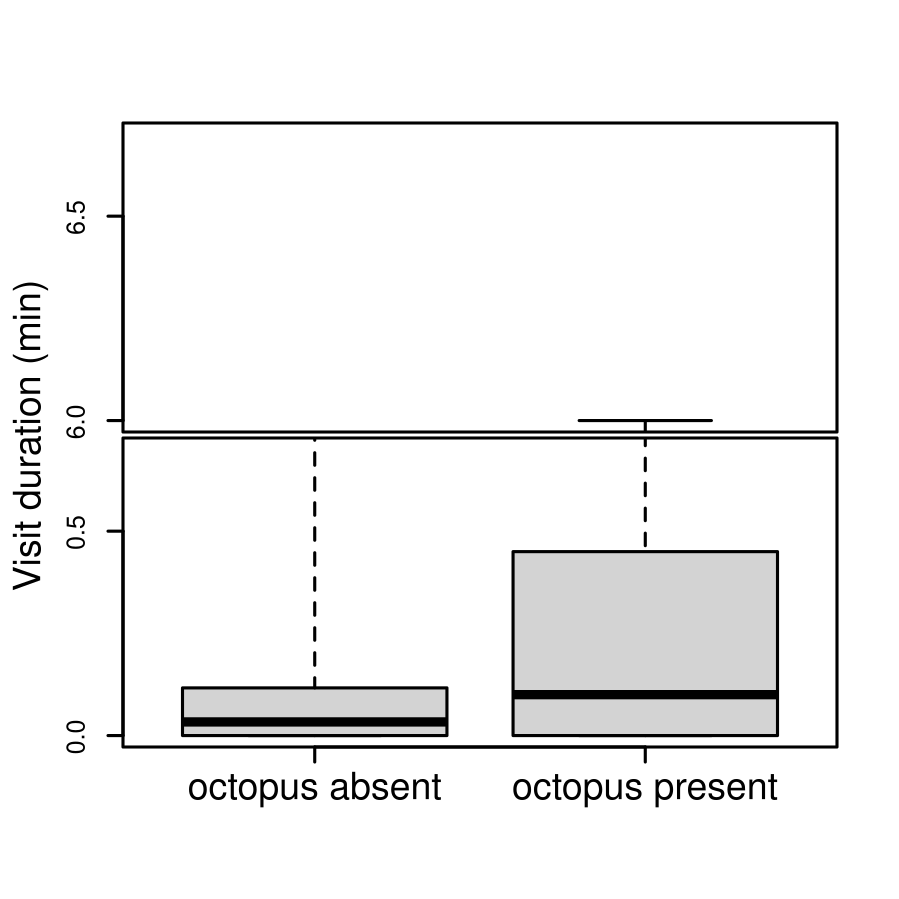

```{r}
library(remotes)
#install_github("KirtOnthank/CircularTimeHistogram")
library(CircularTimeHistogram)
library(googlesheets4)
library(googledrive)
library(lubridate)
library(maptools)
library(circular)
library(plotrix)
library(perm)
```

# Grabbing data and cleaning
Getting google sheets authorization (run at least once before knitting)
```{r eval=FALSE}
drive_auth()
gs4_auth(token = drive_token())
```

Pulling data from google sheets.
```{r}
sheetID="1D53PFAokXS4kHfwSc9riEdKFo8T46GfQxjyo5PEWJg4"
events=read_sheet(sheetID,"event_log",col_types="icccccccccccc")
#changed the google sheet to be an adapted file without additional octopus frame arrivals within the same day

```

Cleaning out unfilled rows.
```{r}
events=events[complete.cases(events$Date),]
events=events[complete.cases(events$Behavior),]

```

Reformatting time to POSIX class to make it easier to calc times.
There seems to be two different formats for dates used in the dataset, so I run this command twice.
```{r}
events$realtime_original=
  strptime(paste(events$Date,events$Time),format="%m/%d/%Y %H:%M:%S")
events$realtime_original[is.na(events$realtime_original)]=
  strptime(paste(events$Date[is.na(events$realtime_original)],events$Time[is.na(events$realtime_original)]),format="%Y/%m/%d %H:%M:%S")

```

## fixing times
```{r}
offsets=read_sheet(sheetID,"time_offsets",col_types="iDTTTTTTTTTTi")
```

```{r}
offsets=offsets[complete.cases(offsets),]
offset.tab=aggregate(offset_min~Deployment,data=offsets,FUN="mean")

events$realtime=events$realtime_original

for (i in 1:nrow(offset.tab)){
  events$realtime[events$`Deployment #`==offset.tab$Deploymen[i]]=
    events$realtime_original[events$`Deployment #`==offset.tab$Deploymen[i]]+(offset.tab$offset_min[i]*60)
}
```

# Den Use Dynamics

Things that were to be tested per the proposal:

#. Mean visitation duration
#. Mean excursion duration
#. Day vs. Night visitation duration (t-test)
#. Day vs. night excursion duration (t-test)

Things I think might be good that wasn't actually proposed

#. Frequency of excursions day vs. night (chi-square)

## Making the visitation dataframe
```{r}
visit=data.frame(deployment=as.numeric(NA),
           octoID=as.character(NA),
           time=as.POSIXct(NA),
           duration=as.numeric(NA))

excursion=data.frame(deployment=as.numeric(NA),
           octoID=as.character(NA),
           time=as.POSIXct(NA),
           duration=as.numeric(NA))

badarrival=data.frame(deployment=as.numeric(NA),
           octoID=as.character(NA),
           time1=as.POSIXct(NA),
           time2=as.POSIXct(NA),
           duration=as.numeric(NA))

baddepar=data.frame(deployment=as.numeric(NA),
           octoID=as.character(NA),
           time1=as.POSIXct(NA),
           time2=as.POSIXct(NA),
           duration=as.numeric(NA))
```


## Extracting visitation durations
```{r}

deployments=unique(events$`Deployment #`)


for (i in 1:length(deployments)){
  arrivals=events$realtime[events$Species=="octopus_rubescens"&
                    events$Event_type=="resident non-interaction"&
                    events$Behavior=="frame_arrival"&
                    events$`Deployment #`==deployments[i]]

  arrivals.ID=events$OctoID[events$Species=="octopus_rubescens"&
                    events$Event_type=="resident non-interaction"&
                    events$Behavior=="frame_arrival"&
                    events$`Deployment #`==deployments[i]]

  departures=events$realtime[events$Species=="octopus_rubescens"&
                    events$Event_type=="resident non-interaction"&
                    events$Behavior=="frame_departure"&
                    events$`Deployment #`==deployments[i]]

  departures.ID=events$OctoID[events$Species=="octopus_rubescens"&
                    events$Event_type=="resident non-interaction"&
                    events$Behavior=="frame_departure"&
                    events$`Deployment #`==deployments[i]]

  depar.tags=c(rep("arrive",length(arrivals)),rep("depart",length(departures)))

  deploy.sub=data.frame(time=c(arrivals,departures),octoID=c(arrivals.ID,departures.ID),type=depar.tags)
  deploy.sub=deploy.sub[order(deploy.sub$time),]

  octos.present=unique(deploy.sub$octoID)

  for (j in 1:length(octos.present)){
    if(sum(deploy.sub$octoID==octos.present[j],na.rm=T)>1){
      deploy.single.octo=deploy.sub[deploy.sub$octoID==octos.present[j],] #selecting only one octopus at a time
      
      #Finding which arrivals are immediately followed by a departure
      visit.depar=which(deploy.single.octo$type[1:(nrow(deploy.single.octo)-1)]=="arrive"&deploy.single.octo$type[2:nrow(deploy.single.octo)]=="depart")
      visit.dura=difftime(deploy.single.octo$time[visit.depar+1],deploy.single.octo$time[visit.depar],units = "min")
      visit.stub=data.frame(deployment=rep(deployments[i],length(visit.dura)),
                 octoID=rep(octos.present[j],length(visit.dura)),
                 time=deploy.single.octo$time[visit.depar],
                 duration=as.numeric(visit.dura))
      visit=rbind(visit,visit.stub)

      # Finding which departures are immecidately followed by an arrival      
      excur.depar=which(deploy.single.octo$type[1:(nrow(deploy.single.octo)-1)]=="depart"&deploy.single.octo$type[2:nrow(deploy.single.octo)]=="arrive")
      excur.dura=difftime(deploy.single.octo$time[excur.depar+1],deploy.single.octo$time[excur.depar],units = "min")
      excur.stub=data.frame(deployment=rep(deployments[i],length(excur.dura)),
                 octoID=rep(octos.present[j],length(excur.dura)),
                 time=deploy.single.octo$time[excur.depar],
                 duration=as.numeric(excur.dura))
      excursion=rbind(excursion,excur.stub)
      
      # Finding arrivals followed immediately by another arrival (This should not be possible, so this is error locating)
      badarrival.depar=which(deploy.single.octo$type[1:(nrow(deploy.single.octo)-1)]=="arrive"&deploy.single.octo$type[2:nrow(deploy.single.octo)]=="arrive")
      badarrival.dura=difftime(deploy.single.octo$time[badarrival.depar+1],deploy.single.octo$time[badarrival.depar],units = "min")
      badarrival.stub=data.frame(deployment=rep(deployments[i],length(badarrival.dura)),
                 octoID=rep(octos.present[j],length(badarrival.dura)),
                 time1=deploy.single.octo$time[badarrival.depar],
                 time2=deploy.single.octo$time[badarrival.depar+1],
                 duration=as.numeric(badarrival.dura))
      badarrival=rbind(badarrival,badarrival.stub)
      
      baddepar.depar=which(deploy.single.octo$type[1:(nrow(deploy.single.octo)-1)]=="depart"&deploy.single.octo$type[2:nrow(deploy.single.octo)]=="depart")
      baddepar.dura=difftime(deploy.single.octo$time[baddepar.depar+1],deploy.single.octo$time[baddepar.depar],units = "min")
      baddepar.stub=data.frame(deployment=rep(deployments[i],length(baddepar.dura)),
                 octoID=rep(octos.present[j],length(baddepar.dura)),
                 time1=deploy.single.octo$time[baddepar.depar],
                 time2=deploy.single.octo$time[baddepar.depar+1],
                 duration=as.numeric(baddepar.dura))
      baddepar=rbind(baddepar,baddepar.stub)
      
    }
  }
}

visit=visit[complete.cases(visit),]
excursion=excursion[complete.cases(excursion),]

```


## Adding Day/Night to the visitation data based on sunrise and sunset times.
```{r}
driftwood=matrix(c(-122.6396394,48.1639127), nrow=1)
bay=SpatialPoints(driftwood, proj4string=CRS("+proj=longlat +datum=WGS84"))

visit$daynight="night"
excursion$daynight="night"
visit$day_expected=0
excursion$day_expected=0

for (i in 1:nrow(visit)){
  sunrise=sunriset(bay, as.POSIXct(visit$time[i]), direction="sunrise", POSIXct.out=TRUE)$time
  sunset=sunriset(bay,  as.POSIXct(visit$time[i]), direction="sunset", POSIXct.out=TRUE)$time
  if (visit$time[i]>sunrise&visit$time[i]<sunset) {
    visit$daynight[i]="day"
  }
  visit$day_expected[i]=as.numeric(difftime(sunset,sunrise,units="hours"))/24
}

for (i in 1:nrow(excursion)){
  sunrise=sunriset(bay, as.POSIXct(excursion$time[i]), direction="sunrise", POSIXct.out=TRUE)$time
  sunset=sunriset(bay,  as.POSIXct(excursion$time[i]), direction="sunset", POSIXct.out=TRUE)$time
  if (excursion$time[i]>sunrise&excursion$time[i]<sunset) {
    excursion$daynight[i]="day"
  }
  excursion$day_expected[i]=as.numeric(difftime(sunset,sunrise,units="hours"))/24
}

```


```{r}
mean(visit$duration)
```
```{r}
mean(excursion$duration)
```


## Adding day night and probabilities to each entry in the event log
```{r}
events$daynight="night"
events$day_expected=0

for (i in 1:nrow(events)){
  sunrise=sunriset(bay, as.POSIXct(events$realtime[i]), direction="sunrise", POSIXct.out=TRUE)$time
  sunset=sunriset(bay,  as.POSIXct(events$realtime[i]), direction="sunset", POSIXct.out=TRUE)$time
  if (events$realtime[i]>sunrise&events$realtime[i]<sunset) {
    events$daynight[i]="day"
  }
  events$day_expected[i]=as.numeric(difftime(sunset,sunrise,units="hours"))/24
}
```


# Conspecific interactions

Things that were to be tested per the proposal:

#. "I will use a chi-square test to compare the frequency of different behaviors during interactions."
#. "I will use a t-test to compare the mean interaction duration and"
#. "chi-square to compare conspecific interaction frequency as a function of the time of day (day vs. night)."
#. "A chi-squared test will be used to determine if the relative size of the octopuses in an interaction affects the outcome."

## Making the visitation dataframe
```{r}
nonres.visit=data.frame(deployment=as.numeric(NA),
           octoID=as.character(NA),
           time=as.POSIXct(NA),
           duration=as.numeric(NA))

```


## Extracting non-resident visitation durations
```{r}

deployments=unique(events$`Deployment #`)


for (i in 1:length(deployments)){
  arrivals=events$realtime[events$Species=="octopus_rubescens"&
                    events$Event_type=="non-resident non-interaction"&
                    events$Behavior=="frame_arrival"&
                    events$`Deployment #`==deployments[i]]

  arrivals.ID=events$OctoID[events$Species=="octopus_rubescens"&
                    events$Event_type=="non-resident non-interaction"&
                    events$Behavior=="frame_arrival"&
                    events$`Deployment #`==deployments[i]]

  departures=events$realtime[events$Species=="octopus_rubescens"&
                    events$Event_type=="non-resident non-interaction"&
                    events$Behavior=="frame_departure"&
                    events$`Deployment #`==deployments[i]]

  departures.ID=events$OctoID[events$Species=="octopus_rubescens"&
                    events$Event_type=="non-resident non-interaction"&
                    events$Behavior=="frame_departure"&
                    events$`Deployment #`==deployments[i]]

  if (length(arrivals)>0){
  depar.tags=c(rep("arrive",length(arrivals)),rep("depart",length(departures)))

  deploy.sub=data.frame(time=c(arrivals,departures),octoID=c(arrivals.ID,departures.ID),type=depar.tags)
  deploy.sub=deploy.sub[order(deploy.sub$time),]

  octos.present=unique(deploy.sub$octoID)

  for (j in 1:length(octos.present)){
    if(sum(deploy.sub$octoID==octos.present[j],na.rm=T)>1){
      deploy.single.octo=deploy.sub[deploy.sub$octoID==octos.present[j],] #selecting only one octopus at a time
      
      #Finding which arrivals are immediately followed by a departure
      visit.depar=which(deploy.single.octo$type[1:(nrow(deploy.single.octo)-1)]=="arrive"&
                          deploy.single.octo$type[2:nrow(deploy.single.octo)]=="depart")
      visit.dura=difftime(deploy.single.octo$time[visit.depar+1],deploy.single.octo$time[visit.depar],units = "min")
      visit.stub=data.frame(deployment=rep(deployments[i],length(visit.dura)),
                 octoID=rep(octos.present[j],length(visit.dura)),
                 time=deploy.single.octo$time[visit.depar],
                 duration=as.numeric(visit.dura))
      nonres.visit=rbind(nonres.visit,visit.stub)

      
      # Finding arrivals followed immediately by another arrival (This should not be possible, so this is error locating)
      badarrival.depar=which(deploy.single.octo$type[1:(nrow(deploy.single.octo)-1)]=="arrive"&
                               deploy.single.octo$type[2:nrow(deploy.single.octo)]=="arrive")
      badarrival.dura=difftime(deploy.single.octo$time[badarrival.depar+1],deploy.single.octo$time[badarrival.depar],units = "min")
      badarrival.stub=data.frame(deployment=rep(deployments[i],length(badarrival.dura)),
                 octoID=rep(octos.present[j],length(badarrival.dura)),
                 time1=deploy.single.octo$time[badarrival.depar],
                 time2=deploy.single.octo$time[badarrival.depar+1],
                 duration=as.numeric(badarrival.dura))
      badarrival=rbind(badarrival,badarrival.stub)
      
      baddepar.depar=which(deploy.single.octo$type[1:(nrow(deploy.single.octo)-1)]=="depart"&
                             deploy.single.octo$type[2:nrow(deploy.single.octo)]=="depart")
      baddepar.dura=difftime(deploy.single.octo$time[baddepar.depar+1],deploy.single.octo$time[baddepar.depar],units = "min")
      baddepar.stub=data.frame(deployment=rep(deployments[i],length(baddepar.dura)),
                 octoID=rep(octos.present[j],length(baddepar.dura)),
                 time1=deploy.single.octo$time[baddepar.depar],
                 time2=deploy.single.octo$time[baddepar.depar+1],
                 duration=as.numeric(baddepar.dura))
      baddepar=rbind(baddepar,baddepar.stub)
    }
    }
  }
}


nonres.visit=nonres.visit[complete.cases(nonres.visit),]
```


## Adding Day/Night to the non-resident visitation data based on sunrise and sunset times.
```{r}

nonres.visit$daynight="night"
nonres.visit$day_expected=0

for (i in 1:nrow(nonres.visit)){
  sunrise=sunriset(bay, as.POSIXct(nonres.visit$time[i]), direction="sunrise", POSIXct.out=TRUE)$time
  sunset=sunriset(bay,  as.POSIXct(nonres.visit$time[i]), direction="sunset", POSIXct.out=TRUE)$time
  if (nonres.visit$time[i]>sunrise&nonres.visit$time[i]<sunset) {
    nonres.visit$daynight[i]="day"
  }
  nonres.visit$day_expected[i]=as.numeric(difftime(sunset,sunrise,units="hours"))/24
}

```


# Random Subsetting

```{r}
events$realtime[events$Species=="octopus_rubescens"&
                    events$Event_type=="non-resident non-interaction"&
                    events$Behavior=="frame_arrival"]
```


##

```{r}
events[events$Event_type=="non-resident non-interaction"&events$Species=="octopus_rubescens"&events$Behavior=="frame_arrival",]
```


```{r}
events[events$Event_type=="non-resident non-interaction"&events$Species=="octopus_rubescens"&events$Behavior=="frame_departure",]
```


```{r}
events[events$Event_type=="nonresident/resident interaction"&events$Species=="octopus_rubescens"|
        events$Event_type=="resident/resident interaction"&events$Species=="octopus_rubescens",]
```


```{r}
table(events$Event_type)
```


```{r}
table(events$`1st Analyst ID`)
```


## Visualization
# Plotting octopus arrival times

#should we be plotting frame arrival because the start of each deployment begins with a frame_arrival, wouldnt it be more useful to plot frame departures??
```{r}
octo.visits=events$realtime[events$Behavior=="frame_arrival"&events$Species=="octopus_rubescens"]

DayHist(octo.visits,date="07/10/2021")
```

#Graph species
#its not ellegant but i can easily change the graph to exclude or include any species I want
```{r}

fish1=events$Species=="lingcod"
fish2=events$Species=="quillback_rockfish"
fish3=events$Species=="pile_perch"
fish4=events$Species=="kelp greenling"
fish5=events$Species=="copper_rockfish"
fish6=events$Species=="painted greenling"
fish7=events$Species=="china_rockfish"
fish8=events$Species=="octopus_rubescens"
fish9=events$Species=="spiny dogfish"
fish10=events$Species=="buffalo sculpin"
fish11=events$Species=="wolf eel"
fish12=events$Species=="flatfish"
fish13=events$Species=="sailfin sculpin"

fish=fish1+fish2+fish3+fish4+fish5+fish6+fish7+fish9+fish10+fish11+fish12+fish13
fish=fish11


crabs1=events$Species=="red rock crab"
crabs2=events$Species=="dungeness crab"
crabs3=events$Species=="cancer crab"
crabs4=events$Species=="helmet_crab"
crabs5=events$Species=="kelp_crab"
crabs6=events$Species=="urchin"
crabs7=events$Species=="sea_cucumber"
crabs8=events$Species=="sea_star"


crabs=crabs8

to.plot=events$realtime[events$Behavior=="frame_arrival"&crabs]

#png(filename="Ling_and_kelpies.png",width=1000,height=1000,res=200)
DayHist(to.plot,date="07/10/2021",hist.zoom = 4)
#dev.off()
to.plot
```

##to graph different behaviors in unison
```{r}

fish1=events$Species=="lingcod"
fish2=events$Species=="quillback_rockfish"
fish4=events$Species=="kelp greenling"
fish5=events$Species=="copper_rockfish"
fish6=events$Species=="painted greenling"
fish7=events$Species=="china_rockfish"
fish8=events$Species=="octopus_rubescens"
fish=fish8


behave1=events$Behavior=="enter_bottle"
behave2=events$Behavior=="fortify"
behave3=events$Behavior=="touch_bottle"
behave4=events$Behavior=="den_opening"
behave5=events$Behavior=="touch_resident"
behave6=events$Behavior=="exit_bottle"
behave7=events$Behavior=="periscope"
behave8=events$Behavior=="predation"
behave9=events$Behavior=="sat_outside"
behave10=events$Behavior=="looking_in_bottle"
behave11=events$Behavior=="depositing_waste_outside_den"

#behave=behave1+behave3+behave4+behave5+behave6+behave7+behave8+behave9+behave10+behave11
#behave=behave5+behave1+behave7+behave6
behave=behave5


to.plot=events$realtime[behave&fish]

#png(filename="Ling_and_kelpies.png",width=1000,height=1000,res=200)
DayHist(to.plot,date="07/10/2021",hist.zoom = 4.5)
#dev.off()
to.plot
```


# Statistical Analysis
## Chi Square example

For this example we will look at kelp greenling visitation.
First we will make a table of the distribution of kelp greenling frame arrival events in the day and night
```{r}
kelpy.daynight=as.numeric(table(events$daynight[events$Behavior=="frame_arrival"&events$Species=="kelp greenling"]))

```
Next we need to make a vector that has the probability of seeing a kelp greenling in the day or night if kelp greenling show up randomly with respect to time.  This essentially, therefore, is what percentage of time is day vs. night.
```{r}
kelpy.probs=c(
mean(events$day_expected[events$Behavior=="frame_arrival"&events$Species=="kelp greenling"]),
1-mean(events$day_expected[events$Behavior=="frame_arrival"&events$Species=="kelp greenling"])
)
kelpy.probs
```

Now we can do the chi-squared test
```{r}
kelpy.chi=chisq.test(kelpy.daynight,p=kelpy.probs)
kelpy.chi
```


## T-test example

Lets look to see if non-resident visits are longer in the day or in the night.   We have already extracted that data and it is in nonres.visit.  So, we can just call it from there. 

First, we need to test our assumptions.  The bartlett test looks for equal variances.
```{r}
bartlett.test(nonres.visit$duration,nonres.visit$daynight)
```
So, we fail the Bartlett test (p<0.05). The variances are no equal between the   We will look at normality as well anyhow using a Shapiro-Wilks test.

```{r}
shapiro.test(nonres.visit$duration[nonres.visit$daynight=="night"])
shapiro.test(nonres.visit$duration[nonres.visit$daynight=="day"])
```

Well, the night data is normally distributed (p>0.05), but the daytime data is not (p<0.05)

The correct way to do this is to use a non-parametric or permutation test. I prefer permutation tests (they are more powerful than non-parametric tests, meaning they are more likely to reject the null hypothesis is it should be). This is how you would do it.  

```{r}
permTS(nonres.visit$duration[nonres.visit$daynight=="day"],nonres.visit$duration[nonres.visit$daynight=="night"],
       alternative="two.sided",method="exact.mc",control=permControl(nmc=10000))
```

If you passed you assumptions test and could do a t-test, this is how you would do it:
```{r}
t.test(duration~daynight,data=nonres.visit,var.equal=T)
```

##octopus visitations: day vs night
```{r}
octo.daynight=as.numeric(table(events$daynight[events$Behavior=="frame_departure"&events$Species=="octopus_rubescens"]))

octo.probs=c(
mean(events$day_expected[events$Behavior=="frame_departure"&events$Species=="octopus_rubescens"]),
1-mean(events$day_expected[events$Behavior=="frame_departure"&events$Species=="octopus_rubescens"])
)

octo.chi=chisq.test(octo.daynight,p=octo.probs)
octo.chi
```


#octopus den fortification: day vs. night
```{r}
octo.daynight=as.numeric(table(events$daynight[events$Behavior=="fortify"&events$Species=="octopus_rubescens"]))

octo.probs=c(
mean(events$day_expected[events$Behavior=="fortify"&events$Species=="octopus_rubescens"]),
1-mean(events$day_expected[events$Behavior=="fortify"&events$Species=="octopus_rubescens"])
)

octo.chi=chisq.test(octo.daynight,p=octo.probs)
octo.chi

```

#crabs day vs night
```{r}

to.plot=events$realtime[events$Behavior=="frame_arrival"&crabs]

crab.daynight=as.numeric(table(events$daynight[events$Behavior=="frame_arrival"&crabs]))
crab.daynight

crab.probs=c(
mean(events$day_expected[events$Behavior=="frame_arrival"&crabs]),
1-mean(events$day_expected[events$Behavior=="frame_arrival"&crabs])
)

crab.chi=chisq.test(crab.daynight,p=crab.probs)
crab.chi

```


# Interspecific Interaction Analysis

Turning all rockfish species into just "rockfish".  I am doing this down here so I don't break your code above that relies on your sorting with different rockfish.  If you change that, we can put this earlier in the code.
```{r}
events$Species[grep("rockfish",events$Species)]="rockfish"
```

Now I am taking a quick look at how many time each species appears in the data.
```{r}
table(events$Species[events$Behavior=="frame_arrival"])
```
It looks like we have enough data to do this analysis on rockfish, red rock crabs, kelp greenling, lingcod and maybe painted greenling. I think everything else doesn't have enough sightings to be worthwile.


## Finding times where there are no octopuses

This code only needs to run once.  I am making a dataframe that specifies how many octopuses are present at any given time. First, I convert all the second_arrivals and second departure to normal frame arrivals and departure events. Then, I exact every time a deployment starts, ends, an octopus arrives, or departs
```{r}
events$Behavior[events$Behavior=="second_departure"]="frame_departure"
events$Behavior[events$Behavior=="second_arrival"]="frame_arrival"

octos.present=events[events$Behavior=="deploy_start"|
         events$Species=="octopus_rubescens"&
         events$Behavior=="frame_arrival"|
         events$Species=="octopus_rubescens"&
         events$Behavior=="frame_departure"|
         events$Species=="octopus_rubescens"&
         events$Behavior=="deploy_start"|
         events$Behavior=="deploy_end",
         ]
```

Next, I make sure that the entries in this dataframe are in chonological order within each deployment.
```{r}

for (i in 1:length(deployments)){
  temp=octos.present[octos.present$`Deployment #`==deployments[i],]
  temp=temp[order(temp$realtime),]
  octos.present[octos.present$`Deployment #`==deployments[i],]=temp
}
```


Now, I add a column to the dataframe called "number" that will be a tally of how many octopuses are in the frame.  I will start each deployment with the number at 0, add an octopus for each frame arrival and substract one octopus for each frame departure.
```{r}
octos.present$number=0

for (i in 1:length(deployments)){
  behaviors=octos.present$Behavior[octos.present$`Deployment #`==deployments[i]]
  present=rep(0,length(behaviors))
  for (j in 2:length(behaviors)){
    if (behaviors[j]=="frame_arrival"){
      present[j]=present[j-1]+1
    }
    if (behaviors[j]=="frame_departure"){
      present[j]=present[j-1]-1
    }
    if (behaviors[j]=="deploy_end"){
      present[j]=present[j-1]
    }
  }
  octos.present$number[octos.present$`Deployment #`==deployments[i]]=present
}

```


The dataframe I made has the start time for each time period, but not the end.  I will add the end by taking the starting time of the next time period.
```{r}
octos.present$endtime=octos.present$realtime[1]


for (i in 1:length(deployments)){
  octos.present$endtime[head(which(octos.present$`Deployment #`==deployments[i]),-1)]= #All of the times excepts the last (which is the end of deployment)
    octos.present$realtime[tail(which(octos.present$`Deployment #`==deployments[i]),-1)] #is replaced by all of the times except the first
}

octos.present=octos.present[!octos.present$Behavior=="deploy_end",]


```


Finding durations of each time period
```{r}
octos.present$duration=as.numeric(difftime(octos.present$endtime,octos.present$realtime,units = "min"))
```

finding total time with and without octopuses
```{r}
min.absent=sum(octos.present$duration[octos.present$number==0])
min.present=sum(octos.present$duration[octos.present$number>0])
min.absent
min.present
```

## Kelp Greenling Analysis
### Kelp Greenling visitation frequency with octopuses absent vs. present.
In this chunk I am tallying kelp greenling arrivals when octopuses are present versus absent.
```{r}
kelpies=numeric()

for (i in 1:nrow(octos.present)){
  kelpies[i]=sum(events$Species=="kelp greenling"&
    events$Behavior=="frame_arrival"&
    events$`Deployment #`==octos.present$`Deployment #`[i]&
    events$realtime>octos.present$realtime[i]&
    events$realtime<octos.present$endtime[i])
}

kelpies.absent=sum(kelpies[octos.present$number==0])
kelpies.present=sum(kelpies[octos.present$number>0])
kelpies.absent
kelpies.present
```

Next I perform a chi square test to see if the kelp greenling visitation frequency is significantly different that random.Here, I am using the probability in each category (absent vs. present) as the proportion of time octopuses were absent versus present.
```{r}
probs=c(min.absent/(min.absent+min.present),min.present/(min.absent+min.present))

chisq.test(c(kelpies.absent,kelpies.present),p=probs)
```


### Kelp greenling visitation duration when octopuses are absent versus present.
First, I make dataframes to hold my visit duration information and catalog potential bad arrivals and departure entries.

```{r}
kelpie.visit=data.frame(deployment=as.numeric(NA),
           time=as.POSIXct(NA),
           duration=as.numeric(NA))

kelpie.badarrival=data.frame(deployment=as.numeric(NA),
           time1=as.POSIXct(NA),
           time2=as.POSIXct(NA),
           duration=as.numeric(NA))

kelpie.baddepar=data.frame(deployment=as.numeric(NA),
           time1=as.POSIXct(NA),
           time2=as.POSIXct(NA),
           duration=as.numeric(NA))

```

Next, I calculate the duration of each kelp greenling visit.

```{r}


for (i in 1:length(deployments)){
  arrivals=events$realtime[events$Species=="kelp greenling"&
                    events$Behavior=="frame_arrival"&
                    events$`Deployment #`==deployments[i]]

  departures=events$realtime[events$Species=="kelp greenling"&
                    events$Behavior=="frame_departure"&
                    events$`Deployment #`==deployments[i]]

  if (length(arrivals)>0){
  depar.tags=c(rep("arrive",length(arrivals)),rep("depart",length(departures)))

  deploy.sub=data.frame(time=c(arrivals,departures),type=depar.tags)
  deploy.sub=deploy.sub[order(deploy.sub$time),]


      #Finding which arrivals are immediately followed by a departure
      visit.depar=which(deploy.sub$type[1:(nrow(deploy.sub)-1)]=="arrive"&
                          deploy.sub$type[2:nrow(deploy.sub)]=="depart")
      # Now calculating the 
      visit.dura=difftime(deploy.sub$time[visit.depar+1],deploy.sub$time[visit.depar],units = "min")
      visit.stub=data.frame(deployment=rep(deployments[i],length(visit.dura)),
                 time=deploy.sub$time[visit.depar],
                 duration=as.numeric(visit.dura))
      kelpie.visit=rbind(kelpie.visit,visit.stub)

            # Finding arrivals followed immediately by another arrival (This should not be possible, so this is error locating)
      badarrival.depar=which(deploy.sub$type[1:(nrow(deploy.sub)-1)]=="arrive"&
                               deploy.sub$type[2:nrow(deploy.sub)]=="arrive")
      badarrival.dura=difftime(deploy.sub$time[badarrival.depar+1],deploy.sub$time[badarrival.depar],units = "min")
      badarrival.stub=data.frame(deployment=rep(deployments[i],length(badarrival.dura)),
                 time1=deploy.sub$time[badarrival.depar],
                 time2=deploy.sub$time[badarrival.depar+1],
                 duration=as.numeric(badarrival.dura))
      kelpie.badarrival=rbind(kelpie.badarrival,badarrival.stub)
      
      baddepar.depar=which(deploy.sub$type[1:(nrow(deploy.sub)-1)]=="depart"&
                             deploy.sub$type[2:nrow(deploy.sub)]=="depart")
      baddepar.dura=difftime(deploy.sub$time[baddepar.depar+1],deploy.sub$time[baddepar.depar],units = "min")
      baddepar.stub=data.frame(deployment=rep(deployments[i],length(baddepar.dura)),
                 time1=deploy.sub$time[baddepar.depar],
                 time2=deploy.sub$time[baddepar.depar+1],
                 duration=as.numeric(baddepar.dura))
      kelpie.baddepar=rbind(kelpie.baddepar,baddepar.stub)

      
    }
}


kelpie.visit=kelpie.visit[complete.cases(kelpie.visit),]
```


Adding if octopuses are present or absent during each visit to my dataframe
```{r}
kelpie.visit$octopus="unknown"


for (i in 1:nrow(octos.present)){
  if (octos.present$number[i]>0){
    kelpie.visit$octopus[kelpie.visit$deployment==octos.present$`Deployment #`[i]&
                 kelpie.visit$time>octos.present$realtime[i]&
                 kelpie.visit$time<octos.present$endtime[i]]="present"
  }
  if (octos.present$number[i]==0){
    kelpie.visit$octopus[kelpie.visit$deployment==octos.present$`Deployment #`[i]&
                 kelpie.visit$time>octos.present$realtime[i]&
                 kelpie.visit$time<octos.present$endtime[i]]="absent"
  }
}

kelpie.visit=kelpie.visit[!kelpie.visit$octopus=="unknown",]
```


Testing my assumptions for T-Test
```{r}
shapiro.test(kelpie.visit$duration[kelpie.visit$octopus=="present"])
shapiro.test(kelpie.visit$duration[kelpie.visit$octopus=="absent"])
bartlett.test(kelpie.visit$duration,kelpie.visit$octopus)
```

Assumptions fail, so I am using a permutation two-sample test.
```{r}
permTS(kelpie.visit$duration[kelpie.visit$octopus=="absent"],kelpie.visit$duration[kelpie.visit$octopus=="present"],
       alternative="two.sided",method="exact.mc",control=permControl(nmc=10000))

```
Very significant!

Seeing what the mean difference is between kelp greenling visit duration when octopuses are absent versus octopuses are present.
```{r}
aggregate(duration~octopus,data=kelpie.visit,FUN="mean")
```
Plotting the data.
```{r}
boxplot(duration~octopus,data=kelpie.visit,range=0)
```

This boxplot looks horrible so I am manually making boxplot with a broken Y-axis so the long tails don't obscure the main portion of the data.

```{r}
svg("Kelpy_visitation_duration.svg",width=3,height=3,pointsize = 6)
par(fig=c(0,1,0.35,1))
boxplot(duration~octopus,data=kelpie.visit,range=0,ylim=c(6,6.7),axes=F,ylab="",xlab="")
axis(2,at=c(6,6.5))
box()

par(fig=c(0,1,0,0.65),new=T)
boxplot(duration~octopus,data=kelpie.visit,range=0,ylim=c(0,0.7),axes=F,ylab="",xlab="")
axis(2,at=c(0,0.5))
axis(1,at=c(1,2),label=c("octopus absent","octopus present"),cex.axis=1.5)
box()

par(fig=c(0,1,0,1),new=T)
plot(c(0,1),c(0,1),type="n",axes=F,ylab="",xlab="")
mtext("Visit duration (min)",side=2,line=2.5,cex=1.5)

dev.off()
```
```{bash}
cairosvg Kelpy_visitation_duration.svg -o Kelpy_visitation_duration.png -d 300
```


